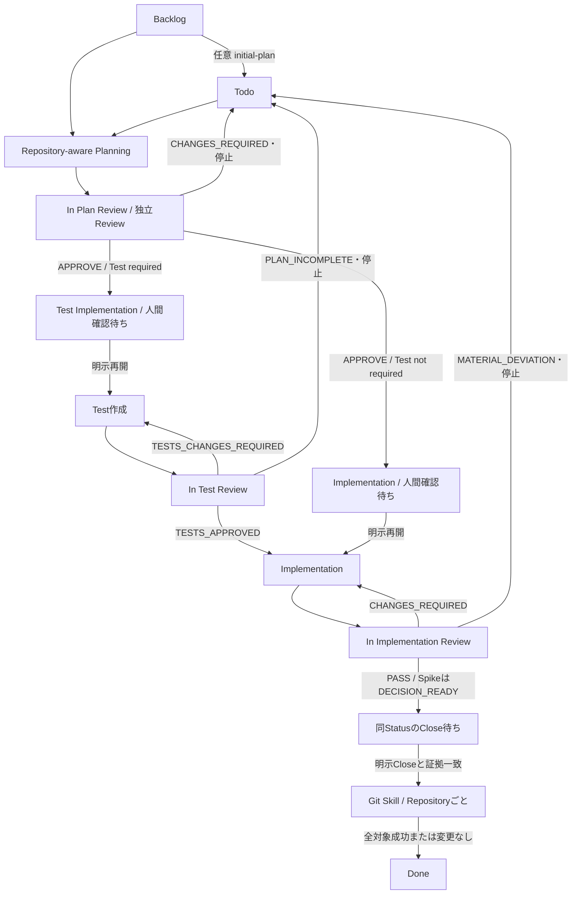
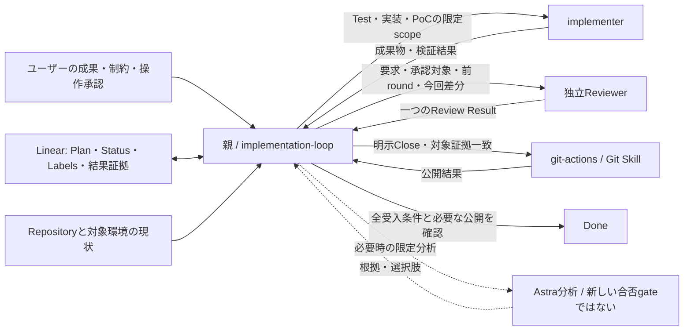
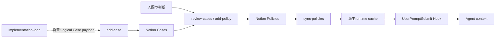

# Agent Development Workflow

Version: 1.0 — 2026-09-05（JST）

位置付け: 全体設計の正本。Currentは調査時点の観測、TargetとProposedの判断は変更提案です。本書の作成はSkill変更・モデル設定変更・公開・既存Issueの完了承認を意味しません。

## 1. Purpose

Linear Issueを起点に、要求をRepositoryで検証し、必要なテスト、限定された実装、独立レビュー、明示的な公開・Closeへ接続します。解決する問題は、作業の途中で要求・対象・承認・検証根拠が失われ、不要な実装や誤った完了判断へ進むことです。

全体構成は、**一つの親Agent、必要時に起動する作業Agentと独立Reviewer、Close専用のGit実行責務**で十分です。現行の単一入口、条件付きTest phase、lightweight既定、明示的Closeは維持します。主な改善対象は、承認対象の鮮度、外部成果物の受入証拠、部分成功後の再開です。

本書は個別Skillの手順書を複製しません。状態の意味、責務、依存方向、判断理由を保持し、具体的なJSON field・コマンド・tool syntaxは各Skill・Agent・Hookを参照します。

## 2. Scope

### 2.0 Engineering Context / Deployment Profile

明示的な別要件がない限り、本Harnessで扱う対象は、single-userの個人Mac上で実行するlocal scriptまたは小規模automationとし、trusted local environmentを前提とします。multi-tenancyはなく、distributed systemではありません。high availability、SLA、大規模なtraffic・data volume、public API compatibilityは既定の要求に含めず、hypothetical future use casesにも対応しません。明示的な別要件がある場合は、その要件を優先します。

この前提に対して、抽象化、設定機構、framework、compatibility layer、依存追加、defensive infrastructure、将来対応を加える場合は、現在のIssue要件、既存構成、安全性、データ保全、既存互換性のいずれかに基づく具体的な必要性を示します。将来の拡張性、一般論としての堅牢性、industry best practice、style preferenceだけでは複雑さを正当化しません。

### 2.1 対象と調査基準

対象は `initial-plan`、`implementation-loop` とphase references、6つのAgent定義、`git-add-commit-push`、Custom Instructions、Hooks、LinearのHIR team状態、および将来のCase/Policy接続境界です。dotfilesはHarnessの展開・setupの依存先として確認しました。一般アプリの機能設計やNotion schemaの詳細は対象外です。

調査開始時のharness HEADは `146b82b61796fd30db1431b9fc4172e862b76c01`、最終確認時は `a0ae561bd4575da2b12e550bc58b1ce9e6de70d6` です。remoteの再fetchはしていません。Currentは最新のローカルHEADと読み取ったworking treeを区別して記載します。

- `implementation-loop/SKILL.md` のLinear専用API規則は、調査開始時は既存の未コミット変更でした。作業中に別の変更で`a0ae561`へコミットされたことを確認しました。本タスクではSkillを変更・commitしていません。remoteへの公開状況は未確認です。
- README、migration関連ファイル、`transaction.py`、受入手順・テストにも既存変更がありました。本書のために編集・取り込み・削除していません。
- Linearは2026-09-05に専用connectorで2 Projectの全Issue一覧を取得しました。Agent Harness 25件、意思決定・違反ログ9件、いずれも次pageなしです。関連16 Issueの本文・関係と、10 Issueの全Commentsを重点確認しました。全Issueの全履歴を監査したという意味ではありません。
- 添付ZIPの7レポートを読み、現物・Git履歴・重点Issueに照合しました。7文書は独立した7事故ではなく、HIR-99の3分析など重複を含みます。ZIPのSHA-256は`00f0a7f040a28cced405f249ab98f7b0799ebfb1205beaccbb29681804a8d4e1`です。

### 2.2 記述の分類

| 分類 | 意味 |
| --- | --- |
| Observed / Current Fact | 現行ファイル・コード・設定・今回取得したLinear状態で確認した事実です。実行成功の証明とは区別します。 |
| Historical Decision | 過去のIssue、Comment、Git履歴で確認した判断です。現行仕様とは限りません。 |
| Interpretation | 根拠から導く解釈です。因果関係を実証したものとは扱いません。 |
| Problem | 現行契約の不整合・欠落です。未発生の失敗シナリオはその旨を示します。 |
| Recommendation | Targetへの提案です。実装済み・承認済みとは扱いません。 |
| Open Question | 資料だけでは確定できない事項です。 |

### 2.3 根拠索引

本文のS/H/L番号はこの索引を参照します。行番号は調査時点のものです。

| ID | 根拠 | 主に確認した事項 |
| --- | --- | --- |
| S1 | `skills/implementation-loop/SKILL.md`、特に26–44、77–145、147–173行 | 共通契約、Review schema、停止境界、fingerprint。34行の専用API規則は`a0ae561`で確定しています。 |
| S2 | `skills/implementation-loop/references/{planning,test,implementation,spike,strict-profile,close}.md` | phase固有責務と遷移です。 |
| S3 | `skills/initial-plan/SKILL.md` | 任意frontend、Repository非参照です。 |
| S4 | `agents/{implementer,git-actions,plan-reviewer,plan-reviewer-lightweight,reviewer,reviewer-lightweight}.toml` | モデル、read-only、scope、Review契約です。 |
| S5 | `skills/git-add-commit-push/SKILL.md` | 引き継いだClose承認、対象path、Git停止条件です。 |
| S6 | `hooks/hooks.json.tmpl`、`hooks/runtime/`、`hooks/tests/` | 登録されたHook、fail-open境界、実client未検証範囲です。 |
| S7 | `README.md`、`custom-instructions/`、`tests/manual-acceptance.md`、隣接dotfilesの`apps/codex/` | 正本と展開、共通指示、setup責務です。 |
| H1 | `HIR-99-overengineering-root-cause.md` | scope増加、strictの旧仕様、定量予算案です。 |
| H2 | `HIR-99-migration-implementation-separation-analysis.md` | 通常setupと一回限りの削除の混同です。 |
| H3 | `HIR-99-push-authorization-incident.md` | Close承認の引継ぎ、外部承認拒否、実行者の不確実性です。 |
| H4 | `HIR-115-review-scope-creep-summary.md` | 妥当な受入不足とscope creep、再認可の要件逆転です。 |
| H5 | `reviewer-output-contract-mismatch.md` | raw JSONと保存Commentの旧契約不一致です。 |
| H6 | ZIP内の`HIR-16-case-policy-τ╡îτ╖».md`（文字化けした格納名。展開時`HIR-16-case-policy-history.md`） | 本文表題は「HIR-16 / Case・Policy 意思決定ログ基盤のインシデント・経緯記録」です。Case/Policy分解、DB作成scope、接続先、502後の重複を確認しました。 |
| H7 | `incident-linear-computer-use-routing-2026-09-04.md` | Linear GUI経由操作です。引用先HIR-119実行ログの329、392、523、534行も照合しました。 |
| L1 | HIR-117、HIR-55、HIR-103、HIR-104、HIR-109の本文・関連Comments | 単一入口、簡素化、Reviewerのモデル分離、承認です。 |
| L2 | HIR-99、HIR-115の現行Planと全Comments | 古いsnapshotと修正後の境界を比較しました。 |
| L3 | HIR-16、HIR-136–140、HIR-142の現行Plan・関係、HIR-16/137/142のComments | Case/Policyは未完了です。HIR-141のDuplicate状態は一覧で確認しました。 |
| L4 | HIR teamのStatus一覧、HIR-88、HIR-135 | 未対応Status、Hook未完了、既存課題との重複を確認しました。 |

歴史的な構成変更は `4d8dbd2`（旧Plan Skill削除・入口統合）、`d111fae`（strict縮小）、`c32dccf` と `34b1411`（Agent/SkillのReview schema統一）で確認できます。これらのcommitと個々のIssueを、Comment等の根拠なく一対一対応とは断定しません。

## 3. Design Principles

1. **成果を先に定義します。** ファイル移動、DB作成、動作修正など、ユーザーの成果と受入条件からscopeを決めます。利用可能なAgentやHookから設計を始めません。
2. **最小の構成を既定にします。** 既存責務の明確化、手順の修正、重複削除を先に行います。新しいstate、service、adapter、Reviewerは最後の選択肢です。
3. **判断と権限を分離します。** Reviewerは技術的な必須修正を判定します。要件変更・外部操作・Closeの承認主体にはなりません。
4. **独立性はモデルの格ではなく役割・文脈・変更権限で確保します。** 作成者と別のReviewerが、同じ要求と対象証拠を確認します。
5. **必要最小の状態を保存します。** Statusはphase、Labelsはmode/profile、Planは要求、Commentsは結果と証拠を所有します。同じ状態を別のローカルDBへ重複保存しません。
6. **根拠が変われば再判定します。** 前回のnon-blockerを無条件に固定せず、新証拠なしに再び必須扱いもしません。
7. **検証は成果物に合わせます。** `Test not required` は無検証ではありません。実機・外部サービスの受入条件は、その環境の観測で確認します。
8. **一回限りの保守を通常runtimeへ埋め込みません。** 安全な手順で足りれば恒久scriptを作りません。既存の通常rollbackを「移行由来」という理由だけで削除しません。
9. **部分成功は失敗による未実行と区別します。** API timeout、push失敗、保存後の応答喪失では、再取得してから次の操作を決めます。

## 4. Current Architecture

### 4.1 Lifecycle

以下は現行Skillが要求する流れです。専用の実行可能な状態機械が自動で強制する流れではありません。

Spikeは同じStatusを使い、ImplementationをExperiment/PoC、最終ReviewをResult Reviewとして解釈します。Test phaseは使いません。図の変更要求による再実行は無制限ではなく、§5.3の停止条件に従います。[S1, S2]

### 4.2 Components

| Component | Responsibility | Input | Output | Model | Stop condition |
| --- | --- | --- | --- | --- | --- |
| initial-plan | Linear情報のみの初期整理です。任意です。 | Backlog Issue、本文、Comments、Labels | 初期Plan、Todo | 呼出元。固定なし | 保存不能、非Backlog、更新完了です。 |
| 親Agent / implementation-loop | phase選択、Repository-aware Planning、要求整合、委譲、結果検証、Linear保存です。 | 最新Issue、会話の明示要件、worktree、適用指示 | canonical Plan、委譲packet、結果Comment、Status | 呼出元。現行PlanningにLuna固定はありません。 | 人間境界、BLOCKED、連続変更要求、Todo戻し、Doneです。 |
| Plan Reviewer | 要求・Repository・検証可能性・最小scopeの独立審査です。 | 保存後のPlan、根拠、要求、Review metadata | APPROVE / CHANGES_REQUIRED / BLOCKED | Terra/high、strictはSol/high | 判定返却または判断不能です。 |
| implementer | Plan内のTest、実装、PoCを担当します。 | Plan、対象path、必要なbaseline | 差分、検証結果、未確認事項 | Luna/medium | Plan不足・逸脱、作業完了です。 |
| Test / Implementation / Result Reviewer | phaseに合う証拠と最小scopeを独立審査します。 | 成果物、Plan、前回結果、今回修正、metadata | phase固有のCanonical Review Result | Terra/high、strictはSol/high | 判定返却または判断不能です。 |
| git-add-commit-push / git-actions | 対象変更だけのstage・commit・通常pushと確認です。 | 検証済みscope、明示Close等の承認、送信先 | commit・push結果または途中停止 | Luna/low。Git role不可時の同等Agent委譲あり | 不明scope、Git不整合、権限不足、成功です。 |
| Hooks | 限定したgh context検査、Notion/local文章のtextlintです。 | 登録イベントのtool入力・結果 | denyまたは文章修正・feedback | Python、LLMなし | 個別Hook契約です。workflowの完了は判定しません。 |
| Linear | Issue要求、phase、mode/profile、判断履歴を保存します。 | 親の限定更新 | 保存状態と再取得結果 | 該当なし | 接続・保存・照合不能です。 |
| Custom Instructions / dotfiles setup | 全作業の行動原則 / 定義の展開を担当します。 | 正本の指示・Agent・Hook定義 | 実行時に読まれる配置 | 該当なし | 展開側の検証不能です。 |

### 4.3 Responsibility Boundaries

親は**作業の要求・権限・scopeを維持する責任者**です。成果物を自分で再レビューしてReviewerの技術判定を覆す役割ではありません。ユーザーの明示指示との衝突は採用前に検出し、clarificationならpacketを直して再Review、実質的Plan変更ならTodoへ戻して停止します。[S1:39–41,84]

implementerはLinear更新、Git/PR操作、外部書込みを行わないよう指示されています。Reviewerはread-onlyで、修正コード・Plan更新・Status更新を行いません。read-only filesystem設定は外部connector書込みの技術的禁止まで保証するものではありません。[S4]

Git Skillだけが公開時の安全手順を所有します。親はReviewとscopeを検証し、各Repositoryの結果を集約してからDoneへ進めます。Gitの手順をClose referenceへ再コピーしません。[S2 close, S5]

### 4.4 正本・設定・強制の境界

| 情報 | 正本・所有者 | 現在の保護方式 |
| --- | --- | --- |
| Issue要求・承認対象Plan | Linear Descriptionの管理領域 | marker・見出し検証と限定更新を親へ指示します。 |
| phase / mode / profile | Linear Status / Spike label / Strict profile label | 親のrouting契約です。 |
| Review・approved-tests・成果物証拠 | Linear Comments | 親がJSON検証・整形・再取得します。実行validatorは確認できません。 |
| モデル・Reviewer filesystem権限 | Agent TOML | 設定として適用します。strict/lightweightの指示本文は同一です。 |
| 行動・外部操作の制限 | Skill / Agent / 適用指示 | 主に自然言語による契約です。 |
| 実行時の配置 | harness正本、dotfilesのsetup | symlink・生成設定・AGENTS連結です。 |

ローカルではagents/skills/runtime Hooksの参照先がharnessに接続されていることを確認しました。これは全client・全taskでの実効モデルやHook起動成功を保証しません。

現行HookにPlan承認・approved-tests・Linear Status・Closeの強制処理はありません。gh guardは主に`gh auth status`と`gh repo create`を対象とし、全Git公開を守る仕組みではありません。textlintは一部の入力を修正し、依存欠落・処理失敗等では原文を保持して継続する経路を持ちます。未修正文章の包括的な禁止gateではありません。[S6]

公式仕様でも複数Hookは併存し、信頼設定が必要です。また一部tool経路はHook対象外となり得ます。Harnessの配置、登録、実際のclient発火は別々に検証すべきです。[OpenAI Hooks](https://learn.chatgpt.com/docs/hooks)

## 5. Current State Machine

### 5.1 Linear Statusの意味

| Status | 現行の意味・開始条件 | 正常forward | backward / 停止 |
| --- | --- | --- | --- |
| Backlog | 初期整理前です。直接Repository-aware Planningも可能です。 | 任意frontendでTodo、またはPlan保存後In Plan Review | 取得・Repository・境界不能でBLOCKEDです。 |
| Todo | Repositoryを確認してPlanを作成・修正します。 | Plan/Label保存後In Plan Review | 取得・保存不能でBLOCKEDです。 |
| In Plan Review | 正しいcanonical境界を持つ保存済みPlanを審査します。 | APPROVEでTest ImplementationまたはImplementationへ更新後停止 | CHANGES_REQUIREDでTodoへ戻し停止します。 |
| Test Implementation | normalかつTest requiredです。専用Test成果物を作成します。 | 成果物・証拠保存後In Test Review | scope/dirty不整合等はBLOCKEDです。 |
| In Test Review | Test成果物を独立審査します。 | TESTS_APPROVEDでImplementationへ継続可能です。 | 修正要求はTest Implementation、Plan不足はTodoへ戻します。 |
| Implementation | normalは実装、Spikeは実験です。 | 証拠保存後In Implementation Review | 不明baseline・Plan外作業は停止します。 |
| In Implementation Review | 実装または実験結果を審査します。 | PASS / DECISION_READYでもStatus維持、明示Close成功後だけDoneです。 | 修正要求はImplementation、実質的乖離はTodoです。 |
| Done | 当該workflowの終端です。 | 追加処理なしです。 | 本Skillは自動再開しません。 |
| Pending / Canceled / Duplicate | HIR teamに実在しますが、Skillのdispatch表に処理がありません。 | 未定義です。 | Targetでは無変更停止を明示します。 |

`BLOCKED`はReview decisionまたは実行結果であり、今回取得したHIR teamのLinear Status名ではありません。独自Statusへ変換しません。[S1, S2, L4]

### 5.2 Statusに含まれない状態

- **人間確認待ち:** Plan APPROVE後は次の作業Statusになっていますが、明示再開まで作業開始しません。Status単体では開始許可を表せません。
- **Close待ち:** In Implementation Reviewの最新正判定と成果物fingerprint一致から導きます。新しいReady-to-Close Statusはありません。
- **Review回数:** Comment履歴が保持します。taskを変えただけで無かったことにはできません。
- **Test baseline:** 最新TESTS_APPROVEDのpath/hash・実行方法・必要な手動確認です。Implementationでは変更禁止です。
- **一部Repositoryだけ公開済み:** Git結果とCommentから復元すべき状態です。専用Linear Statusはありません。

この派生状態はすべて無駄ではありません。ただし「phaseの正本はStatus」を「Statusさえあれば安全に再開できる」と解釈してはいけません。

### 5.3 Retry / failure / stop

| 条件 | 現行挙動 | 限界 |
| --- | --- | --- |
| 不正Review JSON | 形式訂正を1回要求し、再度不正ならBLOCKEDです。 | 別schemaへ自動変換して判定を作り直しません。 |
| 同phaseで2回連続の変更要求 | 通常のbackward transition後、その実行を停止します。 | 全期間の総Review回数上限ではありません。明示再開後の数え方の説明余地は残ります。 |
| Planへの実質的変更 | Todoへ戻し停止します。 | ユーザー変更は明示されていますが、外部編集と過去承認の版照合は十分明示されていません。 |
| 判断不能 / Agent不可 / baseline不一致 | BLOCKEDでStatusを維持します。 | 不足を上位モデルで埋めたことにはできません。 |
| Linear保存失敗・結果不明 | 再取得確認できなければ停止します。 | Comment成功・Status失敗などの再開規約は未定義です。 |
| Git途中状態・push失敗 | 停止し履歴を保持します。 | 既に作成した未送信commitの同一Close再利用は明示されていません。 |

## 6. Model Assignment

現行値はファイルで確認した設定です。比較benchmark、失敗率、料金差、highから上げた場合の限界利益は測定していません。モデル名だけから今回の事故原因や品質差は断定しません。

| Stage | Current model / reasoning | 判断理由とTarget | Escalation |
| --- | --- | --- | --- |
| 初期整理・親orchestration・Planning | Skill固定なし。ローカル既定はAstra/highです。 | 呼出元の選択を維持します。定型進行のためにAstraを必須化しません。Planning担当を再び別Agentへ分離する必要はありません。 | 要求不明ならユーザー確認、技術的な対立なら限定分析です。 |
| Test / Implementation / PoC | Luna/medium | **Keep。** 明確なPlan内の変更に限定します。設計判断までworkerへ渡さないことが前提です。 | Plan不足ならTodo、環境不足ならBLOCKEDです。自動モデル昇格では解決しません。 |
| Plan Review | Terra/high、strictはSol/high | **Keep。** 設計誤りの後工程costと独立性を重視します。highは現行の採用値で、最適性は未実測です。 | strict付与は明示承認が必要です。strict不可なら停止します。 |
| Test / Implementation / Result Review | Terra/high、strictはSol/high | **Keep。** 評価基準は共通です。profileを新しい審査phaseと扱いません。 | 同phase2連続変更要求後にscope・証拠・対立を整理します。 |
| Git公開 | Luna/low | **Keep。** 操作は限定手順とGit結果で判断します。高推論で送信権限は増えません。 | 権限・remote競合・scope混在は停止します。 |
| アーキテクチャ / RCA / 対立解消 | 専用常設roleなし | **必要時のみAstraによる限定分析を提案します。** 複数資料の矛盾、広い変更影響、具体的に対立したReviewが対象です。 | 分析後は元のPlan/Reviewへ戻します。新しい合否gateは作りません。 |

公式資料は、明確で反復的な仕事にLuna、軽い読取り・補助作業にTerra、複雑な推論に高いreasoningを位置付けています。一方、高いreasoningは時間・token使用を増やします。この一般的説明は、本Harnessでの最適性の実測を代替しません。[OpenAI Subagents](https://learn.chatgpt.com/docs/agent-configuration/subagents)

モデル変更の根拠は、既存Commentに残る見逃し、再作業、所要時間、利用量を少数の同種Issueで比較して得ます。専用dashboardや全実行への新しい必須記録項目は追加しません。情報不足・要件の誤読・不正JSON・権限拒否を一括して「モデル性能不足」と分類しません。

## 7. Known Failure Modes

### F1. 要求・scopeがReview修正で拡大または逆転します

- **Symptom:** 再認可不要の要件に反する動作をTestとPASSが追認します。別Issueのdirty変更まで修正対象になります。
- **Root cause:** 報告・履歴から支持される原因は、技術的に有用な指摘と当該Issueで採用できる指摘の混同です。Reviewerの能力不足だけでは説明できません。
- **Detection point:** Plan Review、finding採用前、実機受入です。
- **Current mitigation:** 明示要件との整合、最小scope、新証拠のない再分類禁止、dirty所有権確認です。
- **Remaining risk:** 親の「技術再Review禁止」を権限・scope確認まで不要と解釈すると再発します。境界の説明を統一すべきです。
- **Evidence:** H4、H6、S1:38–41/81–88。HIR-115の現行実装と最新Close記録では再認可修正済みです。

### F2. 古い承認を新しい対象へ流用します

- **Symptom:** Planやprofileを変更しても、同じStatus・同じファイルhashを根拠に再開し得ます。
- **Root cause:** **現行契約から導く未再現シナリオです。** 再取得・構造検証はありますが、Plan APPROVEがどのPlanを承認したかの照合、close判定でのPlan/profile同一性が十分明記されていません。
- **Detection point:** 各phase開始、Review結果保存直前、Close直前です。
- **Current mitigation:** canonical境界、Test hash、成果物fingerprint、最新ユーザー要求との整合です。
- **Remaining risk:** ファイル内容の同一性は要求・承認対象の同一性を証明しません。blockedBy未完了でも自身のStatusだけなら進める契約です。
- **Evidence:** S1:31/68–75/164–173、S2 implementation。HIR-136/140は作業Statusですが依存先HIR-137は未完了です。[L3]

### F3. 形式契約の不一致で有効なReviewを失います

- **Symptom:** raw JSONに保存用の日本語fieldが無いことを理由にBLOCKEDと扱います。
- **Root cause:** 歴史的には生成形式と保存形式の境界が曖昧でした。
- **Detection point:** 親のReview入力検証です。
- **Current mitigation:** 単一Canonical Review Resultと、意味を変えないMarkdown整形へ統一済みです。
- **Remaining risk:** phase referencesに旧`review_phase`語彙が残ります。実行validatorは未確認ですが、それだけで新runtimeが必要とはしません。
- **Evidence:** H5、旧`a552eb7`のAgentと`4d8dbd2`のSkill、現行S1/S4、S2 test:15・implementation:17。

### F4. 自動テストの成功を実環境の受入成功と扱います

- **Symptom:** fixtureは通りますが、実Hook、Finder/Cursor、macOS認可、Notion schemaが未確認です。
- **Root cause:** 代用環境が証明できる性質と、受入条件が要求する観測を混同します。
- **Detection point:** Planの検証方法決定、最終Review、Closeです。
- **Current mitigation:** Test not requiredで実確認を選択可能です。Reviewerは受入適合を評価し、各成果物で未確認事項を記録します。
- **Remaining risk:** HIR-137の成果物はNotion上のDBです。Repository path/SHAだけの共通fingerprintでは実体を表現できません。空のファイル集合をhash化しても代替証拠にはなりません。
- **Evidence:** S1:168、H6、HIR-137現行Plan。S6のテスト結果は77件中75件成功、実client payload等の2件はskipでした。これはHook実機成功の判定ではありません。

### F5. 結果不明を未実行と扱い、重複または再開不能になります

- **Symptom:** 502後にIssueが重複します。Review CommentはあるのにStatusだけ未更新です。commit済みpush未完了から安全に再開できません。
- **Root cause:** 複数保存を一度に成功したものとみなし、途中成功を復元する規約が不足しています。
- **Detection point:** 書込み結果不明時、再開時です。
- **Current mitigation:** 書込み前後の再取得、失敗時停止、Git履歴維持、全Repository成功前のDone禁止です。
- **Remaining risk:** Linearは一括transactionではありません。Git Skillは既存未送信commitを停止条件にするため、同じCloseで作ったcommitにも復旧経路がありません。後者は契約上のシナリオで、今回の実事故として再現していません。
- **Evidence:** H6の502重複、HIR-141/142のlive状態、S1:35、S2 close、S5の状態確認・push失敗条件。

### F6. 接続先・操作経路・承認根拠を引継ぎ損ねます

- **Symptom:** API相当操作をLinear GUIで行います。個人Notionの対象を別workspace候補に寄せます。承認済みCloseで再承認を求めます。
- **Root cause:** 操作対象と経路・権限が委譲時の文脈から失われます。専用規則の不足だけでなく、既存指示を適用しなかった寄与もあります。
- **Detection point:** tool選択前、外部書込み前、Git委譲時です。
- **Current mitigation:** 親のLinear更新責任、限定scope、GitへのClose承認継承、専用API規則です。
- **Remaining risk:** initial-planには同じ専用経路規則がありません。Hookやモデル変更では承認の不足を補えません。
- **Evidence:** H3/H6/H7、S1/S3/S5。誤workspaceへの実書込みやGUIによる無関係field破壊は確認できません。

## 8. Key Historical Incidents

### 8.1 HIR-99: 大きな差分より、通常setupと一回限りの処理の混同が問題でした

**Historical Decision:** 移行初期のPlanは、生成物の検証後に旧配置を削除する処理を含んでいました。実装者がPlanを逸脱しただけという説明では不十分で、Plan段階の責務設定に問題がありました。新しい出力の正しさと、古い領域を削除する権限は別です。[H2]

**再検証:** bookmark、sandbox、symlink、rollbackは具体的な危険への対応であり、すべてを過剰実装とは分類できません。報告の行数は一時点のdirty差分です。公開されたdotfiles `680ded3` の内容とは異なります。最終実装では通常setupから旧削除を取り除いており、報告が提案した恒久migration専用scriptも最終採用ではありません。[H1/H2、Git履歴、L2]

**Interpretation:** 主因は成果・ライフサイクルの境界設定、寄与因子はReviewによる検証の累積です。検出失敗は「妥当な安全対策」を根拠に、その前提となる削除scope自体の必要性を問い直せなかったことです。テスト数や行数の一律上限に予防効果があるという証拠はありません。

**最小是正:** 現行のone-off手順優先を維持します。複雑性を削減するためだけの新しい予算gateは追加しません。

### 8.2 HIR-115: 正しい技術指摘と要求を覆す修正が混在しました

**Historical Fact:** 保存済み認可を利用するという要求に反して、再認可する挙動へ寄せた修正とTestがありました。fixtureの観測不足や共有環境への書込み懸念には妥当な指摘も含まれます。全findingをscope creepと呼ぶのは不正確です。[H4、L2]

**Current Fact:** dotfilesの現行custom-instructions setupは、最初のstatus失敗時のみauthorizeし、保存済みsourceを使用し、危険な出力不一致では停止します。HIR-115はDoneで、Close Commentは `8d5ea3b` とユーザー動作確認を記録しています。再認可バグを未修正の現行問題として再登録しません。

**最小是正:** 新しい技術Reviewerを増やさず、要求・scope・前roundの証拠を同じpacketで維持します。親は衝突を報告し、Reviewerの合否を黙って上書きしません。

### 8.3 HIR-128: Review schemaの改善案と採用案を分けます

H5は、raw JSONを親が補強して保存する方式を推奨していました。現行は、必要なmetadataをReviewerへ渡し、同じ単一JSONとして返す方式を採用しています。どちらも設計可能ですが、現行の整合した方式を旧報告の推奨へ戻す理由はありません。残る旧phase語彙の整理で十分です。[H5、S1/S4]

### 8.4 HIR-16 / HIR-137: DB作成と後続の機能を分離します

物理Property型・Relation・readbackはDB作成に必要です。一方、producer、fake adapter、Policy操作、cacheまでDB作成Issueに含める必要はありません。最新HIR-137はNotion上の2 DB作成・確認だけで、Repository変更は対象外です。[H6、L3]

HIR-137の過去Review Commentは、物理schema不足の指摘と、adapter/fake要求を実際に含みます。ただし当時のPlan全文を版ごとに復元していないため、各Reviewerが自分に渡された当時のPlanへ違反したとは一律に断定しません。

意思決定の正本はNotion、CaseとPolicyは別entity、人間がPolicyを確定するという方向は最新Planで確認できます。Record/IncidentとiCloud Markdown正本の旧案は、HIR-16のmarker外に履歴として残っています。両案を現行設計として併記しません。

502後のHIR-141/142重複は再取得による照合の必要性を示します。Notion workspaceの取違えは報告上のnear missであり、誤書込み確定ではありません。どちらもReviewer増設では直接解決しません。

### 8.5 外部操作: 失敗の種類を混ぜません

HIR-99のpush報告は、スキル上のClose承認が既にあったことを示します。ただし「承認説明が質問形だったから拒否された」という因果関係は未証明です。承認拒否後のpush実行者も、Git authorだけでは確定できません。環境の承認gateは維持し、具体的scope・送信先・既存承認を正確に引き継ぎます。[H3]

Linear GUI報告の引用ログ392行は、invalid element IDによるStatus操作失敗です。成功したStatus更新の証拠に読み替えません。後のAPI成功は「APIが常に利用不能だった」という説明を弱めますが、以前の全時点の可用性まで証明しません。[H7]

## 9. Architecture Assessment

### 9.1 What is working well

単一入口とphaseごとの遅延読込みは構造上成立しています。初期整理は任意、Testは受入に必要な場合だけ、Spikeは既存Statusを再利用します。Reviewerのモデルprofileと評価基準は分離され、Closeは独立した公開責務に委譲されます。これらを再設計する必要はありません。

schema統一、再Reviewの範囲限定、ユーザー要求との先行照合は、報告された失敗へ直接対応します。ただし「規則が存在する」と「事故率が下がった」は別で、後者の測定結果はありません。

### 9.2 Unnecessary complexity

削除済みの旧入口、strict独自の定量予算、多段自動escalationを復活させる必要はありません。6つのTOMLは4つの論理責務の具体的モデルprofileであり、6段の常駐パイプラインではありません。ファイル数だけを減らすための生成器も不要です。

現行の実質的な整理対象は、旧`review_phase`の語彙と、古い文書のsetup path・Agent数です。正規JSONの完全定義が複数Agentへコピーされているため変更時の整合確認は必要ですが、即座に別schema serviceへ切り出す根拠にはなりません。

### 9.3 Responsibility overlap

親のtraceability確認とReviewerの受入確認は、前者を入力・証拠の完備確認、後者を技術判断とすれば両立します。親が同じ成果物をもう一度独自に合否判定する運用は不要です。

同様に、Hooksは局所的tool/文章処理、Skillは業務進行、dotfilesは展開を所有します。Case/Policy記録を導入しても、レビュー合否や公開権限を二重に管理する仕組みにはしません。

### 9.4 Missing safeguards

修正価値がある契約の欠落は、§7 F2/F4/F5の承認対象照合、外部成果物証拠、部分成功の復元です。まず既存のphase開始・保存・Close境界を修正します。独立した常駐controllerや新しい停止phaseは追加しません。

Planが未承認でも `## 承認済みPlan` 見出しはPlanning中から存在します。見出し名を承認証拠にしないことも同じ問題の一部です。

### 9.5 Contradictions found in source materials

| 差異 | 判定 |
| --- | --- |
| `linear-issue-plan-review`が参照資料に存在 / 現物にはない | `4d8dbd2`で削除され、S2 planningに統合済みです。別の現行componentには数えません。 |
| HIR-55がTodo / 入口統合は現物で済み | 元の単一入口統合は対応済みとしてHIR-55をDoneへ更新しました。C1はHIR-152、残る契約・案内整理はHIR-153へ分離しています。 |
| HIR-55のLuna Plan・Sol Review / 現行Planningはモデル固定なし、既定ReviewはTerra | 旧要件と現行構成の差です。HIR-103はReviewer変更だけを承認しています。Planning担当変更の承認由来までは未確定です。 |
| raw JSONと保存Commentの二段schema案 / 現行の単一JSON | 提案と採用結果の違いです。現行を維持します。 |
| strictで必須項目を増やす旧案 / 現行strictはモデル差のみ | 旧仕様です。評価基準を厳格profileだけ再拡張しません。 |
| HIR-99のmigration script案 / 最終版は通常setupから削除処理を除去 | 提案は採用済みではありません。one-off手順優先を維持します。 |
| HIR-16冒頭のRecord/Incident / canonical PlanのCase/Policy | marker外の旧仕様と管理領域の新設計です。新Planは履歴の位置付けを明記しています。 |
| 「Linear専用規則なし」というH7 / 現行Skillに1行あり | 調査時点の差です。開始時dirtyだった是正は、最終確認時に`a0ae561`でcommit済みです。 |
| READMEの旧setup入口・受入文書のAgent 5個 / 現物の新入口・6定義 | 文書追随の問題です。既存dirty変更の所有者と調整して直します。 |

### 9.6 外部実装例から採るもの

AIDD Harness Guideは、Projectごとに必要なルールを選び、生成後のProject文書を正本とし、原本を通常作業で重ねて適用しない雛形集です。完成した自律workflowや、その性能を検証した事例としては扱いません。[AIDD reference README](https://github.com/MasahiroOkamura-MAC/aidd_harness_guide/blob/main/rules_reference/README.md)

本設計では「全体設計と個別手順を分ける」「変更と文書更新を同時に行う」を採ります。多数のrule/templateファイルを一括導入する必要はありません。参照を書くだけで自動読込みされるという前提も置きません。[AIDD rules](https://github.com/MasahiroOkamura-MAC/aidd_harness_guide/blob/main/rules_reference/rules/README.md)

## 10. Target Architecture

### 10.1 最小構成とLifecycle

**Recommendation:** 現行のcomponent、Linear Status、Reviewer profileを維持します。新しいarchitecture review phase、常設Astra Agent、workflow DB、汎用connector adapter、分散transaction機構は追加しません。

forward/backward遷移と人間停止境界は§5を維持します。差分は、各既存境界で読む証拠と不整合時の戻り先を明確にすることです。

### 10.2 Target components / responsibility

| Component | Target responsibility・入出力 | Model | Stop condition |
| --- | --- | --- | --- |
| initial-plan | 任意の要求整理です。専用Linear経路、保存結果不明時の照合を共通化します。 | 呼出元 | 非Backlog・不明保存・完了です。 |
| 親 / Planning | 要求・承認対象・依存・成果物の対応を維持し、限定packetを渡します。外部service作業は明示された対象・操作承認に従い親が実施します。 | 呼出元 | 未承認差分、未充足依存、対象・権限・証拠不明です。 |
| implementer | 現行のTest/実装/PoCに限定します。外部作業のために不要なコードを作りません。 | Luna/medium | Plan外・検証不能です。 |
| 各Reviewer | 同一の要求・scopeを独立評価し、単一schemaで返します。実環境必須条件の未確認をPASSで埋めません。 | Terra/high、strict Sol/high | 判断不能、必須修正、判定完了です。 |
| Git Skill | 公開安全性を維持し、同一Closeでの部分成功を検証して再開します。 | Luna/low | 来歴不明commit、対象の変化、権限・remote不整合です。 |
| Hooks / 配置 | 現行局所責務を維持します。実client発火の証拠を既存Issueで確認します。 | コード | 個別契約です。 |
| Case/Policy拡張 | coreとは別の既存Projectで実装します。必要な事象を記録し、人間がPolicyを確定します。 | 既存計画に従います。 | 接続・保存不能を成功扱いしません。core停止との関係は§14です。 |

### 10.3 既存境界での承認対象照合

Plan APPROVEを保存するときに、レビューしたPlanを後から識別できる最小の情報を同じCommentに残します。以後のTest・Implementation・Closeでは、現在のPlan・mode/profile・Test判定と対応する正判定を照合します。**追加は承認対象を識別する情報だけ**とし、ローカル状態DBやPlan全文の重複保存は作りません。具体的な正規化・field定義はSkill変更時に定めます。Review Resultへ追加する場合は生成側と検証側のschemaを同時に変更し、現行Resultへ親が未定義metadataを後付けする運用にはしません。

差分を確認できれば、無関係なComment追記や表示整形は承認を失効させません。要求・scope・受入条件の実質変更はTodoへ戻します。表示変更か実質変更か判別不能ならBLOCKEDです。profile変更後は変更先profileのReviewが必要ですが、Plan内容が同じなら実装まで無条件に作り直しません。

同様に、必須のblockedByやPlanの前提が未充足ならImplementationを開始しません。Planningや依存を使わないTest準備まで一律に禁止せず、当該作業が依存先を必要とするかで判断します。親の受付で確認するため、新しい「依存審査phase」は不要です。

### 10.4 外部成果物と受入

ファイルは現行fingerprintを使います。Notion DBなど外部成果物は、対象service/workspace/entityと、受入条件に必要なreadback結果を親の検証記録へ保存し、その記録とReviewを対応付けます。Review Result自体のfieldを変える場合はschema変更として扱い、保存整形時の後付けは行いません。Close前に重要な状態を再取得し、Review対象から変わっていないことを確認します。

Repository変更のないIssueではGit公開は該当なしです。ただし「Git差分なし」は外部作業完了を意味しません。HIR-137なら2 DB・Property型・Relationの実readbackが必要です。不要なfake adapterやテストファイルを作ってファイルhashを得る方法は採りません。

必須の実機・外部受入が未確認ならPASSにせず、既存のBLOCKEDで止めます。任意の追加確認と必須条件を区別し、任意の未確認だけを理由にscopeを増やしません。外部作業の承認は元の依頼と対象Planのscopeから確認し、workflow起動によるLinear更新承認を他serviceへの包括的な書込み権限へ拡張しません。

### 10.5 結果不明からの再開

Linearでは、結果不明の操作を再取得で照合します。同一のReview結果が保存済みで現在対象とも一致するなら、再投稿・再Reviewせず未完了のStatus遷移だけを完了します。Plan APPROVE後のStatus復旧でも、人間確認待ちの停止を省略しません。保存の有無が不明、別編集が混在、複数候補の場合は停止します。書込みの自動retryを増やすための設計ではありません。

Gitでは、当該Closeで作成したcommitを一意に証明できる場合だけ、scope・内容・送信先・remote到達状況を再確認して再利用します。そのため失敗時にもcommit hash・Repository・送信先・Issue/Reviewとの対応を既存の停止報告へ残します。hashの一致だけでなく、commit内容とReview対象の一致、未送信範囲に他commitがないこと、remote先行がないことを確認します。既存の無関係commit、混在commit、force pushや履歴変更を必要とする状態には適用しません。複数Repositoryでは成功済み対象を照合し、未完了分だけを実行します。既存のGit結果記録を使い、新しいreceipt serviceは作りません。

### 10.6 Case / Policyとの接続

これは**Historical Decision / planned extension**であり、Current runtimeではありません。HIR-137がDB、HIR-136がPolicy操作、HIR-140がCase保存・二重加算防止、HIR-138が人間Review、HIR-139がcache/Hook、HIR-142がproducer接続を所有します。HIR-142はNotionの物理schemaを知らず、Workflow起点のCaseはFeedback Countを増やしません。[L3]

coreへ必要なのは事象を渡す境界だけです。全イベントのCase化、Policy自動生成、外部LLMによる違反判定、強制Hookを追加する根拠はありません。将来機能の完成を既存workflowの利用条件にはしません。

## 11. Current → Target Delta

各変更はKeep / Simplify / Modify / Remove / Addで分類します。Priorityはこの設計内の相対優先度で、緊急の本番事故発生を意味しません。

| Area / 分類 | Current → Target | 問題・変更しないリスク | 導入する複雑性 / より単純な代替 | Priority |
| --- | --- | --- | --- | --- |
| 単一入口 / Keep | implementation-loop → 変更なし | 旧入口復活は二重routingになります。 | 追加なしです。 | — |
| optional initial-plan / Keep | Linearだけのfrontend → 変更なし | 必須化すると小さいIssueでも重複Planningになります。 | 追加なしです。 | — |
| Status・Test・Spike / Keep | 現行stateと条件分岐 → 変更なし | 状態削減で人間境界やTest基準を失うリスクがあります。 | 追加なしです。 | — |
| 承認対象 / Add | 再取得と成果物hash中心 → 既存CommentにPlan識別と対応を追加 | 要求やprofileが変わっても古い承認を流用し得ます。 | 最小metadataのみです。再取得だけでは過去承認対象を復元できません。 | P0 |
| 依存・未対応Status / Modify | gate未明示 → 現phaseに必要な前提確認、対象外Statusは無変更停止 | 未完成基盤への実装開始、未定義dispatchです。 | 既存relations・Plan・Statusを使う規則だけです。 | P0 |
| 外部成果物 / Modify | Repository hash前提 → 実体のreadbackをReview/Closeへ接続 | DB作成等を証明できず、誤PASSまたは不要なコード作成へ進みます。 | 既存Commentの証拠を使用します。空hashでは代替できません。 | P1 |
| Linear部分保存 / Modify | 再取得と停止 → 保存済み結果を照合し未完了遷移のみ | 重複Comment・再Review・二重更新のリスクです。 | 既存ID/本文とreadbackを使う限定再開です。自動transaction層は不要です。 | P1 |
| Git部分成功 / Modify | 既存未送信commitは停止 → 同一Close来歴を検証した場合だけ再利用 | push失敗後に手動調査が毎回必要です。 | 既存commit/送信先記録を使用します。既存停止を全面解除しません。 | P1 |
| Review語彙 / Remove | 古いreview_phaseが残る → canonical phaseへ統一 | 不要な形式変換・誤判定の余地です。 | 新fieldなしです。互換layerを追加するより削除が単純です。 | P2 |
| Linear routing / Modify | loopに規則あり、frontendに未明示 → 両入口で専用API境界 | GUI相当操作への迂回・環境依存が残ります。 | 短い経路規則のみです。GUI禁止Hookは不要です。 | P2 |
| Reviewer/profile / Keep | 6 TOML、共通基準 → 変更なし | 定義生成器や別審査基準は保守costを増やします。 | 同時更新・整合確認で足ります。 | — |
| モデル構成 / Keep | Luna / Terra / Sol、親は呼出元 → 変更なし | 根拠のない昇格は利用量・時間を増やします。 | 必要時の限定分析のみです。 | — |
| Hook coverage / Modify | unit中心 → 既存Issueでclient発火・結果を確認 | 配置済みを動作済みと誤認します。 | 受入証拠取得が先です。原因未確定でmatcherを拡大しません。 | P1 |
| 旧文書 / Simplify | setup path・Agent数・古いIssue記録 → 現物へ追随 | 不要な再実装・誤setup手順を誘発します。 | 文書訂正だけです。新しい管理システムは不要です。 | P2 |
| Case/Policy / Keep | 既存6子Issueの計画 → 責務と人間判断を維持 | 新しい自動強制を混ぜるとscopeが再膨張します。 | 新規Issueへの重複分割をしません。 | 既存計画 |

## 12. Design Decisions

Acceptedは「現行根拠と整合して維持する判断」、Proposedは「本書の変更案」、Rejectedは「本設計では採用を勧めない案」です。Proposedを作業承認として扱いません。

### D-001: 単一入口と既存stateを維持します

- **Status:** Accepted
- **Context:** 旧Plan Skillは統合済みで、現行stateで通常・Spikeを表現できます。
- **Decision:** 新しいcontroller、state、常設Reviewerを追加しません。
- **Rationale:** 事故の主要な残課題は境界の証拠不足で、段数不足ではありません。
- **Alternatives considered:** Planning再分離、Ready-to-Close state、Astra常設gateです。
- **Consequences:** 派生状態と停止境界を本書で明示し、具体手順はSkillに残します。

### D-002: 技術Reviewと要求・権限の維持を分けます

- **Status:** Accepted
- **Context:** HIR-115/137では有用な指摘とscope外修正が混在しました。
- **Decision:** Reviewerは技術判断、親は要求・権限・対象・結果形式の維持を所有します。
- **Rationale:** 二重技術Reviewを避けつつ、ユーザー指示の逆転を防げます。
- **Alternatives considered:** 全finding無条件採用、親による再採点、第三Reviewerの常設です。
- **Consequences:** 衝突時は再packetまたはTodo戻しです。親はPASSを捏造しません。

### D-003: 承認は現在の対象と対応付けます

- **Status:** Proposed
- **Context:** 再取得とファイルhashだけでは過去に承認されたPlanを一意に復元できません。
- **Decision:** 既存Review Commentに最小のPlan識別を残し、開始・保存・Closeで対応を確認します。
- **Rationale:** stateを増やさず、古い承認の誤用を直接抑えます。
- **Alternatives considered:** Statusのみ、Plan全文snapshot、独立approval DBです。
- **Consequences:** 旧Commentに識別情報がない場合の再Review手順が必要です。全旧Issueの一括移行はしません。

### D-004: 成果物の実体に合わせて受入証拠を選びます

- **Status:** Proposed
- **Context:** HIR-137は外部DBが成果物で、コード生成は対象外です。
- **Decision:** 外部readbackを既存Review/Closeへ接続し、必須実確認の未完了では停止します。
- **Rationale:** fake成果物作成や検証省略を避けられます。
- **Alternatives considered:** すべてRepository hash化、無条件Test phase、外部artifact registryです。
- **Consequences:** 外部変更後の再取得が必要です。接続先・操作権限を限定します。

### D-005: 複雑性の一律数値gateを採用しません

- **Status:** Rejected（数値gateの導入案）
- **Context:** HIR-99報告には行数・テスト数・シナリオ数の上限案があります。
- **Decision:** scopeと公開動作・具体的riskで必要性を判定します。数字は観察に使います。
- **Rationale:** 上限の較正根拠がなく、必要な安全検証まで削る可能性があります。
- **Alternatives considered:** diff倍率、testファイル数上限、固定scenario予算です。
- **Consequences:** Reviewerは「多い」ではなく、不要な責務・実害・最小除去を説明する必要があります。

### D-006: 部分成功を再取得して再利用します

- **Status:** Proposed
- **Context:** 502重複とGit再開の契約上の欠落があります。
- **Decision:** 同一操作の来歴が一意な場合だけ、既存保存・commitを再利用します。
- **Rationale:** 全面retryや履歴書換えを避け、未完了部分だけ進められます。
- **Alternatives considered:** 毎回手動復旧、無条件retry、汎用transaction serviceです。
- **Consequences:** 不明な場合は停止を維持します。新しい権限を推定しません。

### D-007: Case/Policyは人間の判断を保存する拡張とします

- **Status:** Accepted（最新Planの設計境界を維持、実装完了ではありません）
- **Context:** HIR-16はNotion正本へ再設計され、子Issueへ分割されています。
- **Decision:** CaseからPolicyを自動生成せず、coreはlogical payload境界だけを持ちます。
- **Rationale:** 事実記録と将来の行動規範を混同しません。
- **Alternatives considered:** 旧Record/Incident正本、自動違反検出・強制、全event記録です。
- **Consequences:** 既存子Issueで実装します。記録失敗時のcore停止範囲は明確化が必要です。

## 13. Required Changes

実装候補の詳細は `linear-issue-candidates.md` を参照します。ここでは実装可能な責務単位だけを示します。既に修正済みの過去バグは含めません。

### P0

**C1 — phase再開時の承認対象・前提の整合。** S1/S2/S4の境界を揃え、Plan・profile・依存・既存Reviewの関係、未対応Statusの停止を定義します。新規状態機械は作りません。表示だけの変化、実質的Plan変更、profile変更、依存未完了、同一対象の正当な再開を区別して確認します。

### P1

**C2 — 外部成果物のReview/Close。** Notion-onlyなどで実体のreadbackを証拠とし、必須未確認時のBLOCKEDとGit非該当を定義します。HIR-137のDB作成そのものは既存Issueのscopeです。

**C3 — Linear部分保存の照合と再開。** 同一Comment保存済み、Status未更新、応答喪失、第三者編集を区別します。結果不明のblind retryを行わない契約を両入口に揃えます。

**C4 — Git Closeの限定再開。** commit成功・push失敗、既にpush済み・Done未更新、複数Repositoryの部分成功を扱います。来歴の一致しないcommitには既存停止を維持します。

**既存HIR-88 / HIR-35 — Hook実client確認。** textlintはHIR-88、gh guard固有の未確認はHIR-35で、登録・信頼・command起動・stdin payload・結果を実clientで確認し、実証された原因だけを修正します。今回のunit結果で完了扱いにしません。

### P2

**C5 — 現行契約の小さな不整合と案内の整理。** [HIR-153](https://linear.app/hnishim/issue/HIR-153/c5-現行契約の不整合とworkflow案内を整理する)として独立起票しました。旧phase語彙を削除し、Linear API経路を両入口で明示し、正本への参照・setup案内を実態へ合わせます。既存dirty差分の所有者と調整して必要な変更だけを行います。専用生成器・互換schemaは追加しません。

HIR-55の元の単一入口統合は対応済みとしてDoneへ更新しました。C1の照合契約は独立Issue HIR-152、現行契約・旧phase語彙・案内の整理は独立Issue HIR-153として登録し、HIR-55と関連付けます。Case/PolicyはHIR-136–140/142を再利用します。新しいモデル評価システムや過去報告全件のIssue化は必要ありません。

2026-09-05の記録先は、C1がAgent HarnessのBacklog HIR-152（HIR-55と関連、HIR-137をblock）、C2/C3/C4がAgent HarnessのBacklog HIR-149/150/151、C5がAgent HarnessのBacklog HIR-153です。HIR-55は元の統合内容を対応済みとしてDoneへ更新しました。文書追随・Hook確認・Case失敗時の境界は既存HIR-82/88/35/142へ記録しました。Case/Policy各Issueには人間判断事項とBLOCKED境界をコメントで追記しました。いずれも実装開始・既存Plan変更を意味しません。対応とリンクは候補一覧末尾にあります。

## 14. Open Questions

1. **Planningモデルの変更由来:** HIR-55の旧Luna担当から現行の親担当へ移ったことは確認できますが、その個別承認履歴は確定できません。HIR-153の人間判断事項として扱います。現在の役割を無断で戻しません。
2. **Hook実効性:** 実clientの発火、信頼状態、payload相関、空白を含む生成commandの扱いは今回未確認です。テストは77件中75件成功、2件はこの限界を明示したskipです。textlintはHIR-88、gh guardはHIR-35で扱います。
3. **Notion実体:** HIR-137はImplementationですが、今回Notionを直接照合していません。DBの不存在とも作成済みとも断定できません。既存Issueでreadback受入を行います。
4. **Case記録失敗とcore停止の範囲:** HIR-142は記録失敗で停止すると規定しますが、既に完了した実装・Reviewを再実行させるかまでは明確ではありません。記録失敗を隠さず、成功済みcoreを巻き戻さない再開境界を同Issueで明確にすべきです。勝手にbest-effortへ変更しません。
5. **旧正判定の再利用:** Plan識別がない旧Commentをどこまで証拠として扱えるかはC1で決めます。既存Doneの遡及取消や全Issue再Reviewは求めません。
6. **モデル/現行対策の効果:** 失敗率・latency・利用量の比較がなく、Astra常用やstrict拡張の費用対効果は不明です。現時点で変更を要求する未解決バグとは扱いません。

## 15. Maintenance Rules

本書はarchitecture、責務、lifecycle、state、model assignment、設計理由の正本です。個別Skillは具体的prompt・手順・field・tool呼出しの正本、Agent TOMLはrole/model/sandbox、Hooksは局所的な実行処理、Linear Issueは案件の要求・進捗・判断履歴を所有します。

workflowに属するSkillを変更するときは、次の順序で保守します。

1. 個別Skillを更新します。
2. 責務、入出力、phase/停止境界、model、設計原則、他componentへの依存に影響するか確認します。
3. 影響する場合は、同じ変更で本書のCurrent・差分・関連Decisionも更新します。実装detailだけなら本書は更新しません。
4. 対応するAgent・Hook・Linear運用との不整合を確認します。提案は実装・確認されるまでTarget / Proposedに残します。
5. Skill変更はユーザー指定の`validate-skill`ラッパーで検証します。関係するTOML・リンク・既存検証と差分の整合も確認します。設計文書だけの変更に無関係なアプリの全テストを要求しません。
6. 旧仕様はCurrentから除き、判断理由が必要なものだけHistorical Decisionへ残します。旧Issueの未完了表示だけを根拠に実装を復活させません。
7. 新しい未解決事項は必要性と既存Issueを確認して記録します。scope外の改善を元Issueの必須受入に混ぜません。

改訂時はVersion・調査日・基準commitを更新します。Currentの変更は実装の根拠、Targetの変更は具体的問題・変更しないリスク・追加複雑性・より単純な代替を残します。本書全体や添付レポートを全phaseのpromptへ常時注入せず、設計判断や変更影響の確認に使います。
