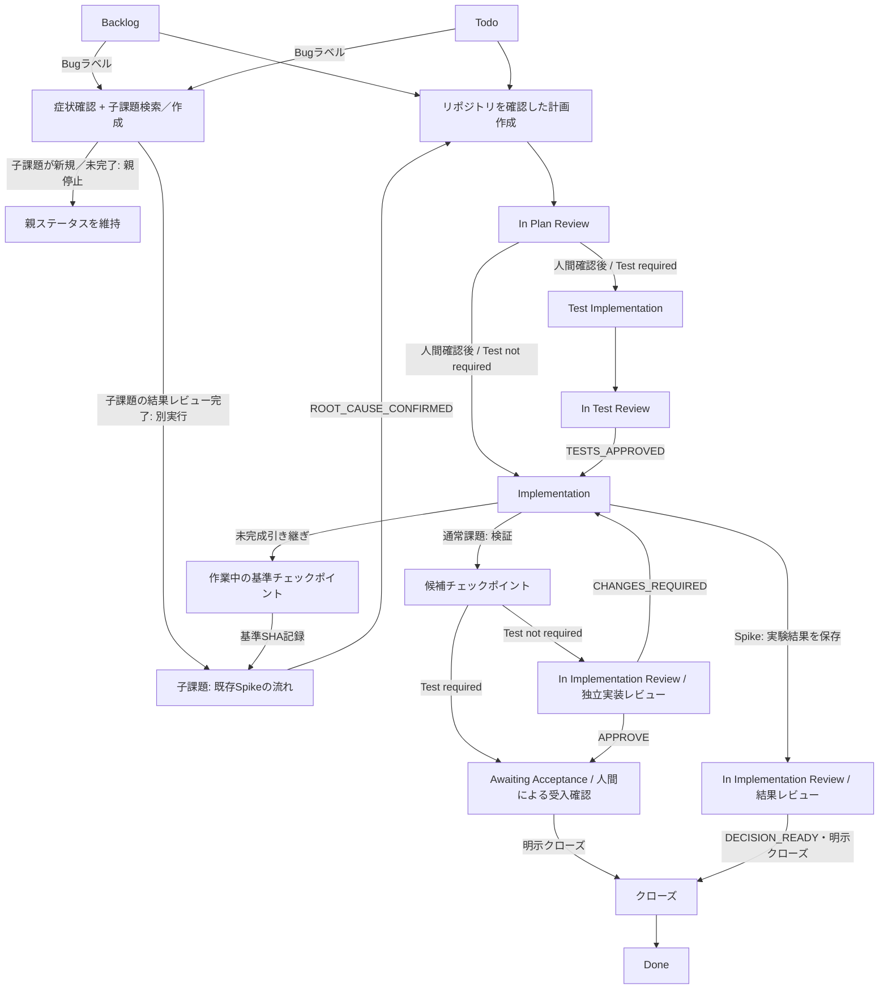
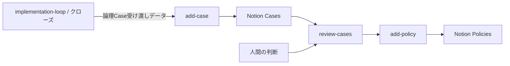

# エージェント開発ワークフロー

バージョン: 1.24 — 2026-09-17（JST）

位置付け: 本書は、Harnessのアーキテクチャ、責務境界、状態遷移、モデル割当、主要な設計理由を示す基準文書です。具体的なフェーズ手順・プロンプト・フィールド・ツール構文は `skills/implementation-loop/` と各エージェント定義が所有します。Linearの個別課題の要求・進捗・判断履歴はLinearが所有します。

## 1. 目的

Linear課題を起点に、要求をリポジトリで確認し、Bugなら原因調査を先行したうえで、必要なテスト、限定された実装またはSpike、検証後の候補checkpoint、人間確認、明示的なクローズへ接続します。目的は、要求・対象・承認・検証根拠を作業中に失わず、未完成の本番用変更や人間による受入確認の対象を再現可能なコミットとして固定し、不要な実装や誤った完了判断を防ぐことです。

現行構成は基準となる `implementation-loop` と、リモート／Chat向けの薄い `remote-implementation-loop` 差し替え層を持ちます。基準となるレビューは常に成果物作成主体とは**独立**した読み取り専用レビュー担当が行い、基準となるローカル実行ではローカル環境のGit実行主体を既定の実行方法とします。リモート環境向け差し替え層は軽量プロファイルを対象とし、現在のフェーズが要求する機能をリモート環境で満たせる範囲で基準となるワークフローを継続します。`Bug` / `Spike` ラベル自体はリモート実行可否の除外条件にしません。`Strict profile` はリモート環境向け差し替え層の対象外として基準となるローカル実行へ引き継ぎます。ローカル環境の作業ツリーを利用できない場合のGitHub上のリモートGit実行主体と受入確認の引き継ぎだけを実行方法の差分とし、独立レビュー担当の利用可否はリモート実行可否の条件にしません。現在の実行で独立レビュー担当を確保できなければ、基準となるレビューステータスで永続的に引き継いで停止します。ステータス、計画、テスト、レビュー判定、永続的な停止、候補／受入確認の意味は共通で、実行主体名をワークフロー状態にしません。

## 2. 対象範囲と分類

### 2.1 利用環境の前提

明示的な別要件がない限り、対象は単一利用者の個人Mac上で実行するローカルスクリプトまたは小規模自動化です。マルチテナント、分散システム、高可用性、SLA、大規模トラフィック・データ量、公開API互換性は既定の要求ではありません。抽象化、フレームワーク、互換層、依存、防御的な基盤、将来対応を加える場合は、現在の課題要件、安全性、データ保全、既存互換性の具体的根拠が必要です。

### 2.2 記述の分類

| 分類 | 意味 |
| --- | --- |
| **Current** | 現行スキル、エージェント、Hook、リポジトリ、または実行時の取り決めから確認できる状態です。 |
| **Historical** | 過去の判断や変更理由です。現行仕様・現行ステータス・実装済み受入の証拠としては扱いません。 |
| **Interpretation** | CurrentまたはHistoricalから導く設計上の解釈です。 |
| **Deferred** | 現行の安全な停止境界を変更せず、必要性と受入条件が明確になった場合だけ再検討する候補です。実装済み・承認済みとは扱いません。 |

過去の調査時点のHEAD、リモート先、課題ステータス、取得件数はCurrentへ固定しません。フェーズ開始時の最新状態からの再取得を現在値とします。

## 3. 設計原則

1. 成果と受入条件から対象範囲を決め、利用可能なエージェントやHookから設計を始めません
2. 既存責務の明確化と重複削除を先に行い、新しい状態、サービス、差し替え層、レビュー担当は必要性がある場合だけ追加します
3. レビュー担当は技術的な必須修正を判断し、親エージェントは要求・権限・対象・結果形式を維持します。要件変更やクローズ承認をレビュー担当へ委譲しません
4. ステータスはフェーズ、ラベルはモード／プロファイル、計画は要求を所有し、Linearコメントは現在の**可変フェーズ状態**と理由追跡が必要な**不変な判断／指摘事項**を所有します。同じ状態を別のローカルDBや改訂ごとのコメントスナップショットへ複製しません
5. 前提、対象、範囲、プロファイル、依存、差分が変われば再照合します。古い承認を新しい対象へ流用しません
6. 検証は成果物の性質に合わせます。自動テスト、**CI検証**、**ローカル環境での受入確認**、**人間による受入確認**を同一視しません
7. 1回限りの保守を通常の実行時処理へ埋め込みません。安全な手順で足りる場合、恒久的な移行やトランザクション層を作りません
8. 部分成功や結果不明を未実行とみなしません。再取得で照合できなければ安全側で停止し、無条件の再試行や履歴変更を行いません
9. 基準となる承認レビューは成果物作成主体と同一実行環境で確定しません。レビューは最新のLinear／Harness／リポジトリの根拠を再取得して行います

## 4. 現行構成

### 4.1 状態遷移

通常課題の流れは、計画作成、独立計画レビュー、必要ならテストと独立テストレビュー、実装、自動検証、利用可能なCI検証、候補checkpointへ進みます。`Test required` は候補checkpoint後に実装レビューを追加せず `Awaiting Acceptance` へ進みます。`Test not required` は `In Implementation Review` で現在の候補に対する最小限の独立実装レビューを行い、レビュー対象候補SHAと現在の候補が一致する `APPROVE` 後に `Awaiting Acceptance` へ進みます。候補が変われば旧承認は失効します。`Awaiting Acceptance` は通常課題のローカル環境／人間による受入確認待ちをステータスとして明示し、AIレビュー中の `In Implementation Review` と責務を分離します。基準となるローカル実行ではローカルコミットをcheckpointとし、対象となるリモート環境向け差し替え層では課題候補ブランチ上の強制更新しない早送りコミットを同じ論理的checkpointとして扱います。候補SHAと人間による受入確認対象を現在のフェーズ状態へ記録し、リモートcheckpointは人間による受入確認前に既定ブランチを更新しません。CI検証がPASSでもローカル環境／人間による受入確認を完了扱いにせず、実行不能な境界は `Awaiting Acceptance` へ引き継ぎます。通常課題をクローズして受理済み候補を対象 `ref` へ公開した後は公開後CI条件を評価し、必須CIの取り決めがあるリポジトリでは公開済みSHAと公開契機の文脈に一致するCI PASSを確認するまで `Done` にしません。CI必須性は提供元の必須設定を最優先し、提供元に必須指定がないことを確認できた場合だけ対象 `ref` 上のリポジトリ所有ワークフロー定義から検証用CIを保守的に分類します。ワークフロー分類や提供元の再取得確認が曖昧なら安全側で停止し、別の台帳へワークフロー識別情報を複製しません。

クローズの開始境界は、**初回開始**と**開始済みクローズの再開**を分離します。初回開始では `Awaiting Acceptance` にある通常課題の人間による受入確認、現在の候補、テスト判定に応じたレビュー条件、計画／対象範囲／受入確認整合、現在の明示的クローズ指示をすべて確認してからクローズ状態を初回作成し、開始条件通過済み・開始済みであることを永続メタデータへ固定します。前提未達のクローズ指示は将来有効な許可として保存せず、後から条件が揃っても再利用しません。開始済みクローズの再開では、開始条件通過後に作成された有効な状態であることを最新状態から再取得確認できる場合だけ同じ状態から再開し、新しいクローズ指示を再要求しません。有効な開始済みクローズ状態は、`entry_gate: passed` / `close_started: true` と受理済み候補またはSpike結果への参照が現在値と整合する状態として扱います。

未完成実装から子Spike・別課題へ移る場合も、本番用変更を論理的な `checkpoint` として有効なGit実行主体へ委譲し、`baseline_commit` として固定して必要なら親子フェーズ状態へ記録してから引き継ぎます。基準となるローカル実行ではローカルcheckpoint、リモート実行では候補 `ref` 上のリモートcheckpointを使います。既存checkpointをリモートへ公開する必要がある場合、親エージェントは送信先リモート／`ref` を先に確定し、Linearに記録・再取得確認済みの当該課題checkpoint列について、その対象 `ref` からの現在の到達性を確認します。対象 `ref` から到達不能で今回の通常プッシュに含めることを許可したcheckpoint SHAだけを古い順の完全列としてGit責務へ渡し、対象 `ref` からHEADまたは候補までの送信対象コミット列全体がその許可列と完全一致する場合だけ通常プッシュを許可します。別のリモート／`ref` へ先行プッシュ済みでも対象 `ref` から未到達なら許可列へ含め、対象 `ref` から既に到達可能なら除外します。対象課題外・由来不明・未承認コミットの混入、許可列の不足・余剰・順序不整合、リモート側の先行・分岐では安全側で停止します。

`Bug` ラベル付き親課題は症状を確認した後、既存のSpikeの流れを使う調査用子課題を1件だけ作成・再利用します。子課題が新規または未完了なら親のステータスを維持して停止し、子課題は独立した課題IDで別のimplementation-loop実行として計画作成、実験／PoC、結果レビューを進みます。親Bugの再実行で `ROOT_CAUSE_CONFIRMED` と原因確定条件を満たした場合だけ親課題の計画作成へ進みます。調査子課題は親Bugと責務を分離し、仮説・識別検証・根拠・`Rejected hypotheses`・結論を所有します。`Bug` / `Spike` ラベル自体はリモート環境向け差し替え層の除外条件にしないため、現在のフェーズで必要な機能をリモート環境で満たせる場合は基準となる流れをリモート環境で継続します。ローカル環境だけで利用可能な機能が必要になった地点では未検証として引き継ぎ、原因確定条件や結果レビューを迂回しません。通常課題の実装レビューは `Test not required` にだけ適用し、`Test required` には追加しません。Spikeは同じ `In Implementation Review` ステータスを結果レビューとして使いますが、通常課題のAIレビューとはモードで区別します。通常課題の人間による受入確認待ちは `Awaiting Acceptance` に分離します。

### 4.2 構成要素と責務

| 構成要素 | 現在の責務 | 停止条件 |
| --- | --- | --- |
| 親エージェント / `implementation-loop` | フェーズ選択、Bug親の症状確認と調査子課題の冪等な作成・再利用、原因確定条件、リポジトリを確認した計画作成、要求・対象範囲・依存の整合、独立レビューの取り決め、ローカルGit実行方法、結果検証、Linear保存を担当します。 | 人間境界、原因未確定、調査子課題不明、子課題未完了、計画外差分、依存未充足、結果不明、判断不能です。 |
| `remote-implementation-loop` | 基準となるフェーズ／参照文書を再利用し、軽量プロファイルで現在のフェーズが要求する機能をリモート環境で満たせる範囲を継続します。ローカル環境の作業ツリーを利用できない場合のリモートGit実行主体と受入確認の引き継ぎだけを差し替え、Bug／Spikeは基準となるモード変更として扱います。レビュー担当の利用可否は実行可否条件にせず、レビューを現在の実行から独立に実行できなければ基準となるレビューステータスで引き継ぎます。`Strict profile` はリモート対象外です。Linear永続化スキーマは所有せず基準となる取り決めをそのまま利用します。 | `Strict profile`、現在のフェーズの必須機能不足、リモート基準不一致、再取得確認不能、独立レビュー引き継ぎ、基準となる停止境界です。 |
| 作業エージェント | 承認済み計画内のテスト、通常実装、またはPoCだけを担当します。Linear、Git公開、外部書き込みは担当しません。 | 計画不足、対象不明、検証不能、対象範囲逸脱です。 |
| レビュー実行主体 | 計画／テスト／`Test not required` の実装／Spike結果を成果物作成主体とは独立した読み取り専用実行環境で評価します。レビュー開始時にLinear、Harness、リポジトリの根拠を最新状態から再取得し、同じレビュー資料／判定の取り決めを使います。 | 判断不能、必須修正、同フェーズ変更要求2回連続、判定完了、独立実行環境を確保できず引き継ぎが必要です。 |
| Git実行主体 | 論理的な `checkpoint` / `publish checkpoint` を実装します。基準となる実行方法はローカル `git-add-commit-push`、リモート実行方法はGitHubの `blob` / `tree` / `commit` / `ref` と強制更新しない再取得確認を使います。受理済み候補とは別SHAを自動生成しません。 | 対象範囲混在、由来不明、基準／`ref` 不一致、由来不一致、リモート先・権限不整合、結果不明です。 |
| Hooks | 局所的なツール入力検査・文章処理だけを担当します。ワークフローの承認・完了判定は担当しません。 | 個別Hookの取り決めに従います。 |
| Linear | 課題要求、基準となる計画、フェーズ、モード／プロファイル、現在の可変フェーズ状態、重要な不変の判断／指摘事項、候補／基準SHA、リモート先／`ref`、検証／受入確認の引き継ぎを保存します。 | 接続、保存、再取得、照合が不能です。 |

親エージェントは要求・権限・対象範囲の責任者ですが、レビュー担当の技術判定を独自に採点し直しません。明示要件と指摘事項が衝突する場合は、明確化ならレビュー資料を更新し、計画を実質変更するなら `Todo` へ戻します。

### 4.3 基準となる情報と保護境界

| 情報 | 基準・所有者 |
| --- | --- |
| 課題要求・承認対象計画 | Linear説明欄の一意な `## 承認済みPlan` → `## 参考情報` 最上位範囲。必要な人間記述保護だけ `HUMAN_AUTHORED_START/END` を手動指定 |
| フェーズ / モード / プロファイル | Linearステータス / `Spike` または `Bug` ラベル / `Strict profile` ラベル |
| 現在のワークフロー状態 | Linearの固定 `state_key` を持つ可変フェーズ状態コメント |
| 重要な判断 / 指摘事項の履歴 | Linearの不変イベントコメント |
| 役割・モデル・sandbox | エージェントTOML |
| フェーズ手順・停止境界・Linear永続化スキーマ | `skills/implementation-loop/` |
| リモート実行方法 | `skills/remote-implementation-loop/` |
| 局所的な実行処理 | Hooks |
| 実行時配置 | Harness基準文書とdotfilesの設定 |

`HUMAN_AUTHORED_START/END` は人間が手動で保全対象として指定したテキストだけをエージェント編集から守る境界です。エージェント経由の説明欄へ自動付与しません。旧 `CODEX_LINEAR_ISSUE_DESCRIPTION_START/END` は旧形式の移行入力としてのみ扱い、所有関係の基準にしません。

Linearの参照・更新は専用API／コネクタ経路を使い、GUIや別コネクタへ自動的に切り替えません。

参照先の存在や設定だけでは、全クライアントでの実効モデル、Hook発火、macOS権限、外部サービス受入を証明しません。必要な実機・外部受入は、その受入条件に対応する環境で別途確認します。

## 5. 現在状態と停止境界

### 5.1 Linearステータス

| ステータス | 現在の意味 | 前方 / 後方 |
| --- | --- | --- |
| Backlog | 通常課題は直接リポジトリを確認した計画作成へ進み、Bug親課題は症状確認と調査子Spikeの検索・必要時の作成を行います。子課題が新規または未完了なら親のステータスを維持して停止します。 | 子課題の結果レビュー完了後に親を再実行し、原因確定条件を満たせば計画保存後に `In Plan Review` です。原因未確定ならステータスを維持して停止します。 |
| Todo | リポジトリを確認します。通常課題は計画を作成・修正し、Bug親課題は調査子Spikeの `ROOT_CAUSE_CONFIRMED` 後に計画を作成・修正します。子課題の状態遷移は別実行です。 | 計画と必要なラベル保存後に `In Plan Review` です。原因未確定ならステータスを維持して停止します。 |
| In Plan Review | 保存済み計画を独立レビュー担当が最新の根拠からレビューします。 | `APPROVE` 後、`Test Implementation` または `Implementation` へ進めて停止します。変更要求は `Todo` へ戻します。独立レビュー担当を現在の実行から確保できないリモート／Chat環境では同ステータスで引き継ぎます。 |
| Test Implementation | `Test required` の課題で専用テスト成果物を作成します。 | `In Test Review` へ進みます。 |
| In Test Review | テスト成果物を独立レビュー担当が最新の根拠からレビューします。 | `TESTS_APPROVED` 後に `Implementation` へ進めます。変更要求は `Test Implementation`、計画不足は `Todo` です。独立レビュー担当を現在の実行から確保できないリモート／Chat環境では同ステータスで引き継ぎます。 |
| Implementation | 通常課題は実装・検証後に候補checkpointを作成し、Spikeは実験を行います。未完成の引き継ぎでは基準checkpointを先に作成します。 | 通常課題は候補SHAとテスト判定を記録し、`Test required` は `Awaiting Acceptance`、`Test not required` は `In Implementation Review` へ進みます。Spikeは結果レビューへ進みます。checkpoint失敗時はステータスを進めません。 |
| In Implementation Review | 通常課題では `Test not required` の現在の候補に対する独立実装レビュー中です。Spikeでは結果レビューです。 | 通常課題は現在の候補に結び付いた `APPROVE` 後に `Awaiting Acceptance` へ進み、`CHANGES_REQUIRED` は `Implementation` へ戻します。候補変更時は旧 `APPROVE` を失効します。独立レビュー担当を確保できない場合は同ステータスで引き継ぎます。 |
| Awaiting Acceptance | 通常課題のAI側実装／必要な実装レビュー完了後のローカル環境／人間による受入確認待ちです。`Test required` は候補checkpoint後に直接到達し、`Test not required` は現在の候補に結び付いた `APPROVE` 後に到達します。 | 受入確認に問題があれば明示再開後に `Implementation` へ戻します。人間による受入確認PASS後も明示クローズが必要で、クローズ開始条件を満たすまで同ステータスを維持します。 |
| Done | ワークフローの終端です。 | 本ワークフローは自動再開しません。 |

対象外ステータスは独自の代替処理や別ステータス変換をせず、無変更で終了します。`Spike` と `Bug` ラベルが同時に付いてモードを一意に判定できない場合、調査子課題を一意に特定できない場合、または `blockedBy`、基準、対象パス、計画、プロファイル、テスト判定が確認できない場合も、推測せず停止します。Bugの症状または原因が未確定の場合は、調査子課題に必要な記録以外を変更せず親のステータスを維持します。

### 5.2 再試行・失敗・停止

- 不正なレビュー結果は形式訂正を一度だけ求め、再度不正ならBLOCKEDです。別スキーマへ自動変換しません
- 同じフェーズで変更要求が2回連続した場合、その実行を停止します。自動エスカレーションで合否を作りません
- Linear保存・外部書き込みの結果が不明な場合、再取得で対象・保存有無・第三者編集を照合できなければ停止します
- Gitの途中状態やcheckpoint・公開失敗では履歴を保持して停止します。リモート実行主体の公開では初回失敗・結果不明後に対象を再取得し、対象未変更かつ由来不変のときだけ同一の強制更新しない操作を1回だけ再試行できます。対象進行／分岐／再取得不能では再試行しません
- 基準となるレビューを現在の実行から独立に実行できないリモート／Chat環境では、正判定を同一実行環境で代替せず、該当レビューステータスと永続的な資料を残して引き継ぎます
- 実機・外部成果物の必須受入が未確認なら、リポジトリ差分や自動テスト、CI検証だけでPASSにしません

## 6. モデル割当

モデルは責務に付随する設定であり、品質・費用・速度の比較結果を表すものではありません。親エージェントと計画作成は**呼出元**をCurrentとし、ローカル環境の既定モデル／推論設定を固定値にしません。

| 段階 | 現在の割当 | 理由 |
| --- | --- | --- |
| 初期整理・親エージェント・計画作成 | 呼出元 | フェーズ選択と要求整合を維持し、常設の高性能条件を作りません。 |
| テスト / 実装 / PoC | Luna / medium | 明確な計画内の変更を限定実行します。 |
| 計画レビュー / テストレビュー / `Test not required` の実装レビュー / Spike結果レビュー | 基準となる独立レビュー: Terra / high。厳格プロファイルはSol / high。別Chat等でも同じレビューの取り決めを使用 | レビューの意味を実行主体名で分岐せず、成果物作成主体から独立した最新レビューを維持します。 |
| Git checkpoint / 公開 | 基準となるローカル実行: Luna / low。リモート実行主体: 呼出元 | 操作は限定手順とGit／`ref` 結果で判断し、モデルで権限を増やしません。 |
| 限定分析 | 必要時の呼出元 | 複数資料の具体的な矛盾や広い影響範囲だけを分析します。新しい合否条件にはしません。 |

## 7. Case / Policyの境界

クローズから `add-case` へ渡す論理Case受け渡しデータがワークフロー側の境界です。ワークフローは事象を記録するための必要な意味情報だけを渡し、NotionのDB URL、データソース、物理Property、Page IDを所有しません。`add-case` はCasesへの写像、スキーマ確認、既存Case照合、保存後再取得確認を所有します。

Caseは事実・事象の記録です。`review-cases` は人間がCaseをレビューし、必要なら `add-policy` でPolicyを作成・更新する入口です。Policyの判断は人間が所有し、Caseから自動生成しません。全イベントのCase化、外部LLMによる違反判定、強制Hook、削除済みActive Policy実行時処理の再導入はCurrentではありません。

## 8. 設計判断と境界

### D-001 — 単一入口と必要最小の状態を維持する（Current）

入口を増やさず、現行ステータスとテスト／Spike／Bug分岐を使います。通常課題ではAIレビュー中と人間による受入確認待ちの責務混同を避けるため `Awaiting Acceptance` を明示的なステータスとして持ち、`Local Acceptance` のような追加ステータスは作りません。Bugの原因調査は `Backlog` / `Todo` 内の必須条件とし、要求・対象・証拠の境界を維持します。

### D-002 — 技術レビューと要求・権限の維持を分ける（Current）

レビュー担当は技術的な指摘事項、親エージェントは要求・対象範囲・権限・結果形式を所有します。指摘事項を無条件採用したり、親が技術判定を上書きしたりしません。

### D-003 — 承認を現在の対象へ対応付ける（Current）

フェーズ開始、レビュー保存、クローズ前に、計画、モード／プロファイル、テスト判定、依存、対象パス、意味のある差分、未確認事項を照合します。計画全文スナップショット、常設DB、必須Fingerprintは作りません。`Test not required` の実装レビューはレビュー対象候補SHAをフェーズ状態へ保存し、現在の候補と一致するときだけ正判定を有効とします。

### D-004 — 成果物に合う証拠を使う（Current）

リポジトリ差分、自動テスト、CI検証、ローカル環境での受入確認、人間による受入確認、外部再取得確認を同一視しません。ファイル／設定／コマンドの存在、解析／コンパイル、ソース確認、ラッパーの戻り値／通知だけでは実行時の有効性・実行成功・利用者の操作経路成功を認定しません。「実利用経路 / 実行入口」はリポジトリのソースと実利用入口が分離する場合だけ必要な範囲で対応を確認します。「実際の仕様影響」「診断根拠の保持」「基準文書との同期」は、それぞれの条件が成立する場合だけ独立に追跡し、実行時経路の分離や他条件の成立から適用を推論しません。外部成果物は対象サービス／workspace／entityの再取得確認を証拠とし、未確認の必須条件では停止します。

### D-005 — 固定数値条件を採用しない（Current）

行数、テスト数、シナリオ数だけで複雑性や品質を判定しません。不要な責務、具体的なリスク、最小の除去方法で対象範囲を判断します。

### D-006 — 結果不明と部分成功は安全側で停止する（Current）

Linear、外部サービス、Gitで保存や公開の結果が不明な場合は再取得して照合し、照合不能なら停止します。無条件の再試行、重複保存、履歴変更は行いません。リモートGit実行主体の1回限定再試行は、再取得確認で対象未変更と由来不変を確認できた場合だけの通信上の例外です。

### D-007 — 部分成功の限定再開はDeferredとする

同一クローズで作成したコミットや保存済みレビューを由来・対象・内容・送信先まで一意に証明できる場合だけ、未完了遷移を再利用する案は再検討候補です。Linear／Git／外部成果物の部分成功再開はCurrent実装ではなく、必要性と受入条件が確定するまで安全側の停止を維持します。

### D-008 — Bugは原因確定後にだけ計画へ進む（Current）

`Bug` ラベル付き親課題は、`Backlog` / `Todo` のまま症状を確認し、既存のSpikeの流れを使う調査用子課題を1件だけ作成・再利用します。新規作成時は親子関係、`Spike` ラベル、初期ステータス `Backlog` を設定し、子課題IDを親へ保存・再取得確認します。子課題が未完了なら親を停止し、子課題を独立したimplementation-loop入力として別実行します。子課題には原因仮説、有力な代替仮説がある場合の識別検証、根拠、`Rejected hypotheses`、結論を保存し、直接的な証拠で `ROOT_CAUSE_CONFIRMED` になった場合だけ親課題の計画へ進みます。原因未確定・再現不能・結果不明なら親のステータスを維持します。Bugは回帰テストを必須とし、既存の計画レビュー、テストレビュー、人間による受入確認、明示クローズの境界は変更しません。修正成功だけを原因の証明にしません。

### D-009 — テストは失敗発生境界と振る舞いを基準にする（Current）

テストの主層は、課題の受入条件と実際の失敗発生境界から選びます。単体、結合、E2E／受入、静的検査、手動確認の責務を混同せず、外部境界をモック／検証用データで置き換えた場合の未検証範囲を明示します。失敗発生境界を直接通るテストは合理的かつ安全に自動化可能な場合に要求し、自動化が困難な場合は理由、保証範囲、未検証範囲、代替する結合／E2E／手動確認／人間による受入確認を明示します。Bug修正では修正前の不具合ケースFAIL、既存正常ケースの隣接回帰、修正後の両方PASSを可能な範囲で確認します。静的検査は実行時の振る舞いの代替にせず、非同期処理は固定待機より観測可能な状態変化を優先します。`Test not required` ではN/A埋めのテスト戦略スキーマを強制せず、テスト不要の理由と根拠を記録します。

### D-010 — リファクタリング / 保守で承認外の動作変更を混在させない（Current）

課題の目的がリファクタリング、後片付け、保守等で利用者に見える動作を変えない前提の場合、実装中に動作変更が必要になっても後片付けの一部として進めません。基準となる計画で承認済みの範囲だけ継続し、未承認の動作変更が必要なら `Todo` へ戻して再計画します。新しいリファクタリング用モード、ステータス、ラベルの意味は追加しません。

### D-011 — 人間による受入確認対象と引き継ぎ基準をcheckpointで固定する（Current）

通常課題は自動テスト／検証後、対象変更を候補コミットへ固定します。`Test required` はcheckpoint後に `Awaiting Acceptance` へ進み、`Test not required` は `In Implementation Review` で現在の候補に結び付くレビューを経て `APPROVE` 後に `Awaiting Acceptance` へ進みます。基準となるローカル実行ではローカルcheckpoint、対象となるリモート環境向け差し替え層では候補ブランチのリモートcheckpointを使います。候補SHA、リモート先／`ref`、人間による受入確認対象をLinearフェーズ状態へ記録し、checkpoint自体は課題の `Done` や既定ブランチ公開を意味しません。人間による受入確認FAILで同じ課題を再実装する場合は旧候補を保持したまま新候補checkpointを積めます。`Test not required` では候補変更により旧実装レビュー承認も失効します。クローズでは受理済み候補SHAを変えず、対象 `ref` ごとの由来確認を通った既存候補列だけを公開し、強制プッシュや履歴書き換えを行いません。

### D-012 — リモート環境向け差し替え層はフェーズ / 機能で実行可否を判定する（Current）

`remote-implementation-loop` は基準となる方法論を分岐させず、軽量プロファイルの課題について現在のフェーズが要求する機能をリモート環境で満たせるかを判定します。`Bug` / `Spike` ラベル自体は除外条件にしない。基準となるモードの意味、原因確定条件、Spike結果レビューをそのまま使い、リモート環境で必要機能を満たせるフェーズは継続します。ローカル環境だけまたは利用不能な機能が必要になった地点では未検証事項と実行入口を残して引き継ぎます。通常課題の候補ができた後にローカル環境での受入確認をリモート環境で実行できない場合は `Awaiting Acceptance` を維持します。`Strict profile` は引き続きリモート対象外です。独立レビュー担当の利用可否は差し替え層の実行可否条件にせず、レビューは常に基準となる独立契約を維持します。現在のリモート実行から独立レビュー担当を確保できない場合はレビューを代替せず、該当レビューステータスへ永続的に引き継ぎます。ローカル環境の作業ツリーを利用できずGitHubリポジトリの読み書きが利用可能な場合だけGitHub API／コネクタによるリモートGit実行主体を使い、ローカルGitが利用できる環境の通信を置換しません。リモート公開は再取得確認を優先し、対象未変更かつ由来不変の場合だけ同一の強制更新しない操作を1回再試行でき、PRマージ／`squash`／`rebase` で候補SHAを変える代替処理は行いません。

### D-013 — 通常課題のクローズは公開後CIを公開済みSHAへ結び付ける（Current）

通常課題の受理済み候補を対象 `ref` へ公開した後、必須CIの取り決めがあるリポジトリでは公開後CI条件を通過するまで `Done` へ進みません。必須性は提供元側の必須指定を最優先し、提供元に必須指定がないことを確認できた場合だけ対象 `ref` 上のリポジトリ所有ワークフロー定義から検証用CIを保守的に分類します。検証ワークフローは対象 `ref` へのプッシュ適用条件と識別情報を使って必須集合を決め、release／deploy／docs／maintenance等は自動昇格させません。分類、起動条件の適用、提供元の再取得確認が曖昧な場合は安全側で停止します。CI適用可否と実行結果の観測を分離し、一致する実行の未観測をCIなしへ変換しません。GitHub Actionsでは公開イベント、対象ブランチ、公開済みSHAを一致させ、`completed` / `success` だけをPASSとします。ローカル／リモートGit実行主体は同じ基準となるクローズの意味を使い、提供元／API通信だけを実行方法の差分とします。

### D-014 — Linearは可変フェーズ状態 + 不変な判断／指摘事項で永続化する（Current）

同じ論理フェーズの引き継ぎ、改訂、承認レビュー、受入確認待ち、CI待ちは固定 `state_key` とコメントIDを持つ可変フェーズ状態へ現在値として更新します。最新状態からの再開／独立レビュー／クローズに必要な成果物／候補の結び付け、レビュー資料／結果、検証境界、未検証事項、参照コメントIDを現在状態から再構築できるようにします。一方、変更理由の監査に必要なレビュー指摘事項、具体的なBLOCKED、受入確認FAIL、Bug原因調査の根拠、Spikeの主要指摘事項／最終判断は不変イベントとして追記します。これにより永続性を維持しつつ、同じ事実の改訂スナップショットや承認済み引き継ぎ／結果全文をコメント列へ反復しません。具体的なスキーマとフェーズ別 `state_key` は `skills/implementation-loop/` が所有し、リモート環境向け差し替え層は複製しません。

### D-015 — クローズ許可は初回開始条件通過後にだけ永続化する（Current）

クローズでは、前提未達の明示指示を将来の許可として残さないことを状態境界とします。初回開始は計画／レビュー／受入確認／候補整合と現在の明示的クローズ指示を確認してからクローズ状態を作成し、開始条件通過済みメタデータを保存します。未達ならクローズ状態・クローズ許可・拒否済み指示を永続化せず停止します。開始済みクローズの再開は、そのメタデータを最新状態から再取得して有効な開始済み状態と確認できた場合だけ同じ状態から継続し、新しいクローズ指示を再要求しません。有効な開始済み状態は `entry_gate: passed` / `close_started: true` と受理済み候補またはSpike結果への参照が現在値と整合する状態とします。

説明欄の所有境界もエージェント管理マーカーではなく人間作成保護へ反転します。人間が手動で `HUMAN_AUTHORED_START/END` を付けた部分だけをエージェント編集から保護し、エージェントは自動付与しません。旧CODEXマーカーは既存の意味内容を失わない移行入力としてのみ読み、基準となる計画は説明欄内の一意な最上位見出し範囲で識別します。

## 9. 保守規則

本書を変更するときは、アーキテクチャ、責務、状態遷移、モデル割当、設計理由への影響だけを反映します。

1. スキルは具体的なフェーズ手順・プロンプト・フィールド・ツール呼び出し、エージェントTOMLは役割／モデル／sandbox、Hooksは局所的な実行処理、Linearは課題の要求・進捗・判断履歴を所有します
2. スキルやエージェントの変更が責務、入出力、フェーズ、停止境界、モデル、他構成要素への依存に影響する場合だけ、本書のCurrent・境界・判断を同時に更新します
3. 未実装の変更はDeferredとして明示し、Currentの実装済み事項や受入済み事項と混同しません
4. 過去の調査記録、課題番号ベースの進捗、外部受入記録を本書の第二の基準にしません。必要な履歴は各所有元に残します
5. 改訂時はバージョン・日付を更新し、不要になったHistoricalの説明や重複する管理情報を削除します
