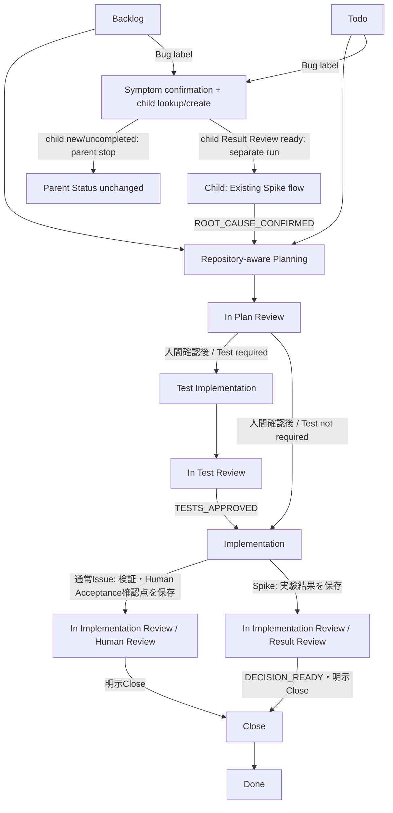
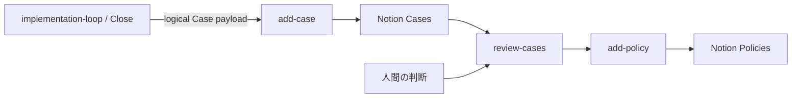

# Agent Development Workflow

Version: 1.9 — 2026-09-10（JST）

位置付け：本書は、Harnessのarchitecture、責務境界、lifecycle/state、model assignment、主要な設計理由を示すcanonicalです。具体的なphase手順・prompt・field・tool syntaxは `skills/implementation-loop/` と各Agent定義が所有します。Linearの個別Issueの要求・進捗・判断履歴はLinearが所有します。

## 1. Purpose

Linear Issueを起点に、要求をRepositoryで確認し、Bugなら原因調査を先行したうえで、必要なTest、限定されたImplementationまたはSpike、Review、人間確認、明示的なCloseへ接続します。目的は、要求・対象・承認・検証根拠を作業中に失わず、不要な実装や誤った完了判断を防ぐことです。

現行構成は、1つの親Agent、必要時に起動する作業Agentと独立Reviewer、Close専用のGit責務で構成します。単一入口、条件付きTest phase、明示的な人間境界、safe-stopを維持します。

## 2. Scope and classification

### 2.1 Deployment profile

明示的な別要件がない限り、対象はsingle-userの個人Mac上で実行するlocal scriptまたは小規模automationです。Multi-tenancy、distributed system、High availability、SLA、大規模traffic・data volume、public API compatibilityは既定の要求ではありません。抽象化、framework、compatibility layer、依存、defensive infrastructure、将来対応を加える場合は、現在のIssue要件、安全性、データ保全、既存互換性の具体的根拠が必要です。

### 2.2 記述の分類

| 分類 | 意味 |
| --- | --- |
| **Current** | 現行Skill、Agent、Hook、Repository、または実行時の契約から確認できる状態です。 |
| **Historical** | 過去の判断や変更理由です。現行仕様・現行Status・実装済み受入の証拠としては扱いません。 |
| **Interpretation** | CurrentまたはHistoricalから導く設計上の解釈です。 |
| **Deferred** | 現行safe-stopを変更せず、必要性と受入条件が明確になった場合だけ再検討する候補です。実装済み・承認済みとは扱いません。 |

過去の調査時点のHEAD、remote、Issue Status、取得件数はCurrentへ固定しません。Phase開始時のlive readbackを現在値とします。

## 3. Design principles

1. 成果と受入条件からscopeを決め、利用可能なAgentやHookから設計を始めません
2. 既存責務の明確化と重複削除を先に行い、新しいstate、service、adapter、Reviewerは必要性がある場合だけ追加します
3. Reviewerは技術的な必須修正を判断し、親Agentは要求・権限・対象・結果形式を維持します。要件変更やClose承認をReviewerへ委譲しません
4. Statusはphase、Labelsはmode/profile、Planは要求、CommentsはReview結果と証拠を所有します。同じ状態を別のlocal DBへ複製しません
5. 前提、対象、scope、profile、依存、差分が変われば再照合します。古い承認を新しい対象へ流用しません
6. 検証は成果物の性質に合わせます。自動Testの成功は、実機・外部サービス・人間受入の成功を意味しません
7. 1回限りの保守を通常runtimeへ埋め込みません。安全な手順で足りる場合、恒久migrationやtransaction層を作りません
8. 部分成功や結果不明を未実行とみなしません。再取得で照合できなければsafe-stopし、無条件retryや履歴変更を行いません

## 4. Current architecture

### 4.1 Lifecycle

通常Issueの流れは、Planning、Plan Review、必要ならTest、Implementation、検証、Human Review、明示Closeです。Bug label付き親Issueは症状を確認した後、既存Spike flowを使う調査用子Issueを1件だけ作成・再利用します。子Issueが新規または未完了なら親のStatusを維持して停止し、子Issueは独立したIssue IDで別のimplementation-loop実行としてPlanning、Experiment/PoC、Result Reviewを進みます。親Bugの再実行で `ROOT_CAUSE_CONFIRMED` とRoot Cause Gateを満たした場合だけ親IssueのPlanningへ進みます。調査子Issueは親Bugと責務を分離し、仮説・識別検証・Evidence・Rejected hypotheses・結論を所有します。通常IssueのImplementation完了後にAIの独立Implementation Reviewは行いません。Spikeは同じStatusをResult Reviewとして使いますが、通常IssueのHuman Reviewとは区別します。

### 4.2 Components and responsibility

| Component | Current responsibility | Stop condition |
| --- | --- | --- |
| `initial-plan` | 任意の初期整理です。Repositoryを前提にせず、Linearの要求を整理します。 | 対象Status、取得、保存、readbackが不明です。 |
| 親Agent / `implementation-loop` | phase選択、Bug親の症状確認と調査子Issueの冪等な作成・再利用、親への子Issue ID保存・readback、Root Cause Gate、Repository-aware Planning、要求・scope・依存の整合、委譲、結果検証、Linear保存を担当します。子Issueのlifecycleは別のimplementation-loop実行に委ねます。 | 人間境界、原因未確定、調査子Issue不明、子Issue未完了、Plan外差分、依存未充足、結果不明、判断不能です。 |
| 作業Agent | approved Plan内のTest、通常Implementation、またはPoCだけを担当します。Linear、Git公開、外部書込みは担当しません。 | Plan不足、対象不明、検証不能、scope逸脱です。 |
| Reviewer | Plan、Test、SpikeのResultを、同じ要求と対象証拠から独立read-onlyで評価します。 | 判断不能、必須修正、判定完了です。 |
| Git Skill / Git actions | 明示Close後の対象pathの公開、commit、push、結果確認を担当します。 | scope混在、来歴不明、remote・権限不整合、途中状態です。 |
| Hooks | 局所的なtool入力検査・文章処理だけを担当します。workflowの承認・完了判定は担当しません。 | 個別Hook契約に従います。 |
| Linear | Issue要求、Plan、phase、mode/profile、Review結果、進捗と判断履歴を保存します。 | 接続、保存、再取得、照合が不能です。 |

親Agentは要求・権限・scopeの責任者ですが、Reviewerの技術判定を独自に採点し直しません。明示要件とfindingが衝突する場合は、clarificationならReview packetを更新し、Planを実質変更するならTodoへ戻します。

### 4.3 正本と保護境界

| 情報 | 正本・所有者 |
| --- | --- |
| Issue要求・承認対象Plan | Linear Descriptionのcanonical marker内 |
| phase / mode / profile | Linear Status / SpikeまたはBug label / Strict profile label |
| Review結果・成果物証拠 | Linear Comments |
| role・model・sandbox | Agent TOML |
| phase手順・停止境界 | `skills/implementation-loop/` |
| 局所的な実行処理 | Hooks |
| 実行時配置 | Harness正本とdotfiles setup |

Linearの参照・更新は専用API/connector経路を使い、GUIや別connectorへfallbackしません。

参照先の存在や設定だけでは、全clientでの実効モデル、Hook発火、macOS権限、外部サービス受入を証明しません。必要な実機・外部受入は、その受入条件に対応する環境で別途確認します。

## 5. Current state and stop boundaries

### 5.1 Linear Status

| Status | Current meaning | Forward / backward |
| --- | --- | --- |
| Backlog | 初期整理前です。通常Issueは任意のinitial-planまたは直接Planningへ進め、Bug親Issueは症状確認と調査子Spikeの検索・必要時の作成を行います。子Issueが新規または未完了なら親のStatusを維持して停止します。 | 子IssueのResult Review完了後に親を再実行し、Root Cause Gateを満たせばPlan保存後にIn Plan Reviewです。原因未確定ならStatusを維持して停止します。 |
| Todo | Repositoryを確認します。通常IssueはPlanを作成・修正し、Bug親Issueは調査子Spikeの `ROOT_CAUSE_CONFIRMED` 後にPlanを作成・修正します。子Issueのlifecycleは別実行です。 | Planと必要なLabel保存後にIn Plan Reviewです。原因未確定ならStatusを維持して停止します。 |
| In Plan Review | 保存済みPlanを独立Reviewします。 | APPROVE後、Test ImplementationまたはImplementationへ進めて停止します。変更要求はTodoへ戻します。 |
| Test Implementation | Test requiredのIssueで専用Test成果物を作成します。 | In Test Reviewへ進みます。 |
| In Test Review | Test成果物を独立Reviewします。 | TESTS_APPROVED後にImplementationへ進めます。変更要求はTest Implementation、Plan不足はTodoです。 |
| Implementation | 通常Issueは実装・検証、Spikeは実験を行います。 | 通常IssueはHuman Review、SpikeはResult Reviewへ進みます。 |
| In Implementation Review | 通常IssueはHuman Review待ち、SpikeはResult Reviewです。 | 問題があれば明示再開後にImplementationへ戻します。完了後も明示Closeが必要です。 |
| Done | workflowの終端です。 | 本workflowは自動再開しません。 |

対象外Statusは独自fallbackや別Status変換をせず、無変更で終了します。`Spike` と `Bug` labelが同時に付いてmodeを一意に判定できない場合、調査子Issueを一意に特定できない場合、または `blockedBy`、baseline、対象path、Plan、profile、Test判定が確認できない場合も、推測せず停止します。Bugの症状または原因が未確定の場合は、調査子Issueに必要な記録以外を変更せず親のStatusを維持します。

### 5.2 Retry / failure / stop

- 不正なReview Resultは形式訂正を一度だけ求め、再度不正ならBLOCKEDです。別schemaへ自動変換しません
- 同じphaseで変更要求が2回連続した場合、その実行を停止します。自動escalationで合否を作りません
- Linear保存・外部書込みの結果が不明な場合、再取得で対象・保存有無・第三者編集を照合できなければ停止します
- Gitの途中状態やpush失敗では履歴を保持して停止します。未送信commitを新しい操作の根拠として推測利用しません
- 実機・外部成果物の必須受入が未確認なら、Repository差分や自動TestだけでPASSにしません

## 6. Model assignment

モデルは責務に付随する設定であり、品質・費用・速度の比較結果を表すものではありません。親AgentとPlanningは**呼出元**をCurrentとし、ローカル環境の既定model/reasoningを固定値にしません。

| Stage | Current assignment | Reason |
| --- | --- | --- |
| 初期整理・親Agent・Planning | 呼出元 | phase選択と要求整合を維持し、常設の高性能gateを作りません。 |
| Test / Implementation / PoC | Luna / medium | 明確なPlan内の変更を限定実行します。 |
| Plan Review / Test Review / Spike Result Review | Terra / high。strict profileはSol / high | 作業Agentと独立した技術評価を行います。strictはモデル差だけで、別phaseや追加必須項目ではありません。 |
| Git公開 | Luna / low | 操作は限定手順とGit結果で判断し、モデルで権限を増やしません。 |
| 限定分析 | 必要時の呼出元 | 複数資料の具体的な矛盾や広い影響範囲だけを分析します。新しい合否gateにはしません。 |

## 7. Case / Policy boundary

Closeから `add-case` へ渡すlogical Case payloadがworkflow側の境界です。Workflowは事象を記録するための必要な意味情報だけを渡し、NotionのDB URL、data source、物理Property、Page IDを所有しません。`add-case` はCasesへのmapping、schema確認、既存Case照合、保存後readbackを所有します。

Caseは事実・事象の記録です。`review-cases` は人間がCaseをレビューし、必要なら `add-policy` でPolicyを作成・更新する入口です。Policyの判断は人間が所有し、Caseから自動生成しません。全イベントのCase化、外部LLMによる違反判定、強制Hook、削除済みActive Policy runtimeの再導入はCurrentではありません。

## 8. Design decisions and boundaries

### D-001 — 単一入口と既存stateを維持する（Current）

旧入口や新しいStatusを復活・追加せず、現行StatusとTest/Spike/Bug分岐を使います。Bugの原因調査はBacklog/Todo内の必須ゲートとし、要求・対象・証拠の境界を維持します。

### D-002 — 技術Reviewと要求・権限の維持を分ける（Current）

Reviewerは技術的finding、親Agentは要求・scope・権限・結果形式を所有します。Findingを無条件採用したり、親が技術判定を上書きしたりしません。

### D-003 — 承認を現在の対象へ対応付ける（Current）

Phase開始、Review保存、Close前に、Plan、mode/profile、Test判定、依存、対象path、意味のある差分、未確認事項を照合します。Plan全文snapshot、常設DB、必須Fingerprintは作りません。

### D-004 — 成果物に合う証拠を使う（Current）

Repository差分、自動Test、実機、外部readback、人間受入を同一視しません。File/config/commandの存在、parse/compile、source inspection、wrapperのreturn/alertだけではruntimeでのeffective・実行成功・user-flow成功を認定しません。Repository sourceと実利用entry pointが分離する場合は必要な範囲で対応を確認し、actual contractのcaller/consumerへ影響する変更だけを追跡します。外部成果物は対象service/workspace/entityのreadbackを証拠とし、未確認の必須条件では停止します。

### D-005 — 固定数値gateを採用しない（Current）

行数、Test数、scenario数だけで複雑性や品質を判定しません。不要な責務、具体的なrisk、最小の除去方法でscopeを判断します。

### D-006 — 結果不明と部分成功はsafe-stopする（Current）

Linear、外部サービス、Gitで保存や公開の結果が不明な場合は再取得して照合し、照合不能なら停止します。無条件retry、重複保存、履歴変更は行いません。

### D-007 — 部分成功の限定再開はDeferredとする

同一Closeで作成したcommitや保存済みReviewを来歴・対象・内容・送信先まで一意に証明できる場合だけ、未完了遷移を再利用する案は再検討候補です。Linear／Git／外部成果物の部分成功再開はCurrent実装ではなく、必要性と受入条件が確定するまでsafe-stopを維持します。

### D-008 — Bugは原因確定後にだけPlanへ進む（Current）

`Bug` label付き親Issueは、Backlog/Todoのまま症状を確認し、既存のSpike flowを使う調査用子Issueを1件だけ作成・再利用します。新規作成時は親子関係、`Spike` label、初期Status `Backlog` を設定し、子Issue IDを親へ保存・readbackします。子Issueが未完了なら親を停止し、子Issueを独立したimplementation-loop入力として別実行します。子Issueにはroot-cause hypothesis、plausible alternativesがある場合のdiscriminating test、Evidence、Rejected hypotheses、結論を保存し、直接的な証拠で `ROOT_CAUSE_CONFIRMED` になった場合だけ親IssueのPlanへ進みます。原因未確定・再現不能・結果不明なら親のStatusを維持します。Bugは回帰Testを必須とし、既存のPlan Review、Test Review、Human Acceptance、明示Closeの境界は変更しません。修正成功だけをroot causeの証明にしません。

### D-009 — Testはfailure boundaryとbehaviorを正本にする（Current）

Testの主layerは、IssueのAcceptance Criteriaと実際のfailure boundaryから選びます。Unit、Integration、E2E/Acceptance、Static assertion、Manual checkの責務を混同せず、外部境界をmock/fixtureで置き換えた場合の未検証範囲を明示します。Failure boundaryを直接通るTestは合理的かつ安全に自動化可能な場合に要求し、自動化が困難な場合は理由、保証範囲、未検証範囲、代替するintegration/E2E/manual check/Human Acceptanceを明示します。Bug fixでは修正前のbug case FAIL、既存正常caseの隣接regression、修正後の両方PASSを可能な範囲で確認します。Static assertionはruntime behaviorの代替にせず、非同期処理は固定delayより観測可能な状態変化を優先します。`Test not required` ではN/A埋めのTest Strategy schemaを強制せず、Test不要の理由と根拠を記録します。

## 9. Maintenance rules

本書を変更するときは、architecture、責務、lifecycle/state、model assignment、設計理由への影響だけを反映します。

1. Skillは具体的なphase手順・prompt・field・tool呼出し、Agent TOMLはrole/model/sandbox、Hooksは局所的な実行処理、LinearはIssueの要求・進捗・判断履歴を所有します
2. SkillやAgentの変更が責務、入出力、phase、停止境界、model、他componentへの依存に影響する場合だけ、本書のCurrent・Boundary・Decisionを同時に更新します
3. 未実装の変更はDeferredとして明示し、Currentの実装済み事項や受入済み事項と混同しません
4. 過去の調査記録、Issue番号ベースの進捗、外部受入記録を本書の第二の正本にしません。必要な履歴は各所有元に残します
5. 改訂時はVersion・日付を更新し、不要になったHistorical narrativeや重複する管理情報を削除します
